---
## Front matter
title: "Отчёт по модулю 1 курса ‘Stepik Введение в Linux’"
subtitle: "Дисциплина: Операционные системы"
author: "Мацюк Константин Владимирович"
institute: "Российский университет дружбы народов"
date: "2026"

## Generic options
lang: ru-RU

## Beamer options
theme: "metropolis"
colortheme: "default"
fonttheme: "default"
mainfont: "IBM Plex Serif"
sansfont: "IBM Plex Sans"
monofont: "IBM Plex Mono"
fontsize: 10pt
aspectratio: 169
section-titles: false
slide-level: 1
toc: false
section-titles: true
toc-depth: 1
header-includes:
  - \usepackage{float}
  - \usepackage{indentfirst}
---

## Содержание (1)

- Цель работы
- Задание
- Общая информация
- Как установить Linux
- Осваиваем Linux
- Terminal: основы

## Содержание (2)

- Запуск исполняемых файлов
- Ввод / Вывод
- Скачивание файлов
- Работа с архивами
- Поиск файлов и слов в файлах
- Выводы

# Цель работы

Пройти курс «Введение в Linux» (модуль 1).

# Задание

Выполнить модуль 1.

# Общая информация

Ответил на первый вопрос о названии курса.

{#fig:001 width=70%}

##

Далее — вопрос про общую информацию о курсе.

{#fig:002 width=70%}

# Как установить Linux

##

Выбираю систему Windows, так как в повседневной жизни пользуюсь ей.

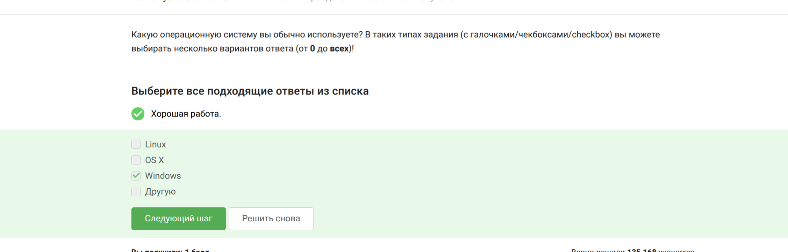{#fig:003 width=70%}

##

Виртуальная машина позволяет запустить ОС внутри основной системы.

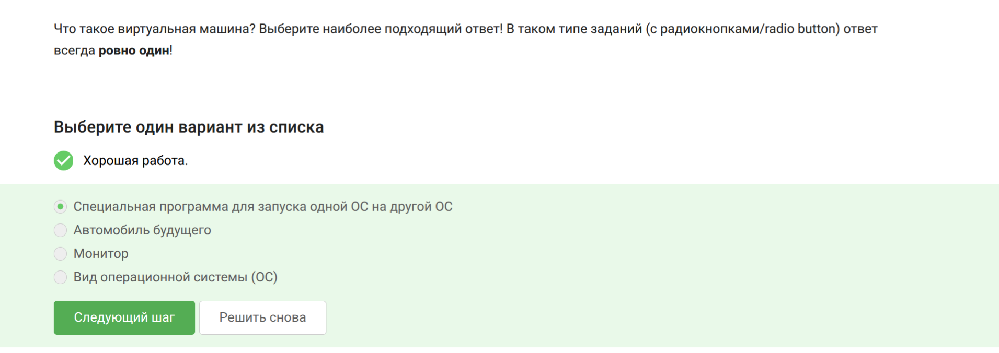{#fig:004 width=70%}

##

Ответил «да», так как уже пользовался системой Linux.

{#fig:005 width=70%}

# Осваиваем Linux

##

Создаю XML-файл со строкой Hello, Linux! в LibreOffice Writer.

{#fig:006 width=70%}

##

В Ubuntu пакеты имеют расширение deb.

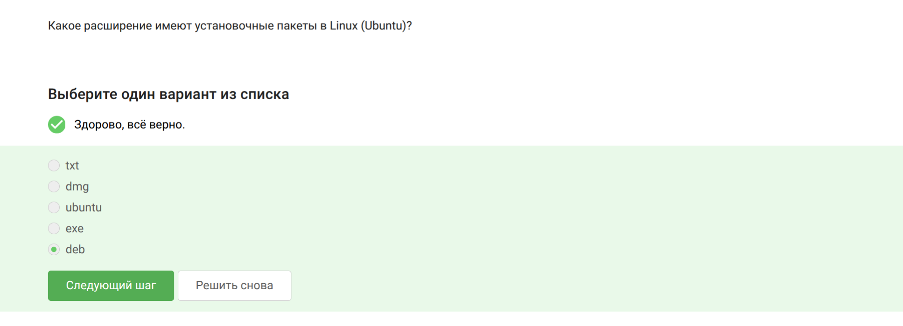{#fig:007 width=70%}

##

Первая фамилия в списке авторов VLC — Denis-Courmont.

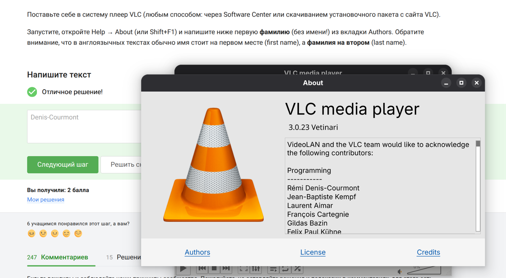{#fig:008 width=70%}

# Terminal: основы

##

Update Manager нужен для обновлений системы и программ. Выбираю подходящие ответы.

{#fig:009 width=70%}

##

Терминал, консоль и командная строка — синонимы.

{#fig:010 width=70%}

##

Только `pwd` (маленькими буквами) показывает текущую папку.

{#fig:011 width=70%}

##

Все варианты эквивалентны, порядок опций не важен.

{#fig:012 width=70%}

##

Директории удаляются командой `rm -r`.

{#fig:013 width=70%}

# Запуск исполняемых файлов

##

После `exit` терминал закроется, Firefox останется.

{#fig:014 width=70%}

##

`&` эквивалентен запуску, затем `Ctrl+Z`, потом `bg`.

{#fig:015 width=70%}

##

Скрипт вывел дату и контрольную сумму 954.

{#fig:016 width=70%}

# Ввод / Вывод

##

Ошибки (stderr) по умолчанию выводятся на экран.

{#fig:017 width=70%}

##

Надо использовать `2>` или `2>>` для перенаправления ошибок.

{#fig:018 width=70%}

##

В конвейере (pipe) ошибки всё равно идут на экран.

{#fig:019 width=70%}

# Скачивание файлов

##

Файл сохранится как `/home/alex/1.jpg`.

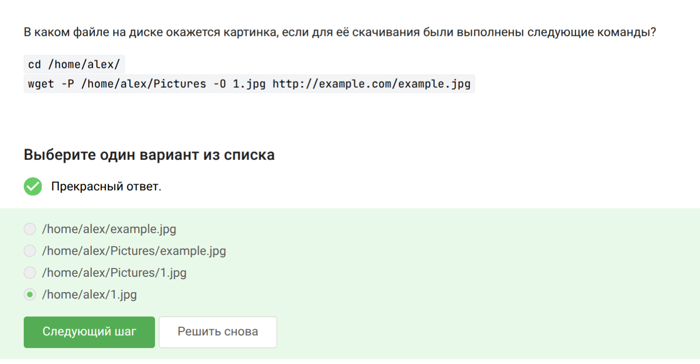{#fig:020 width=70%}

##

Опция `-q` (quiet) подавляет вывод сообщений.

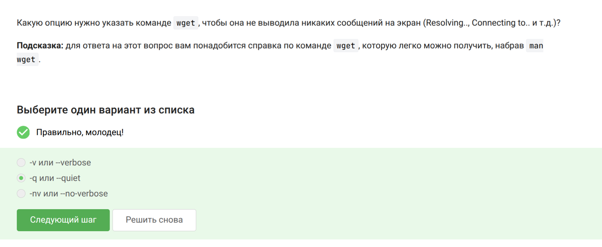{#fig:021 width=70%}

##

Скачаются jpg и html, но html потом удалятся.

{#fig:022 width=70%}

# Работа с архивами

##

`gzip` удаляет исходный архив после распаковки.

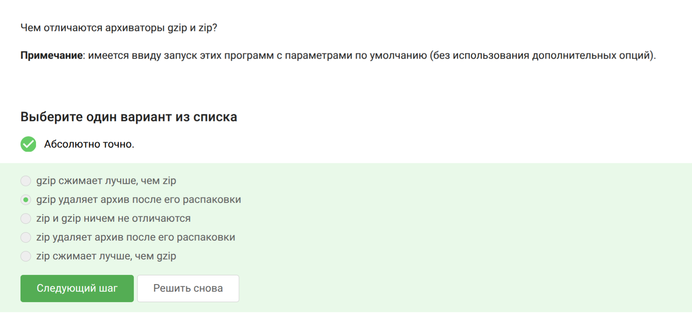{#fig:023 width=70%}

##

`tar` и `zip` могут упаковать целую папку.

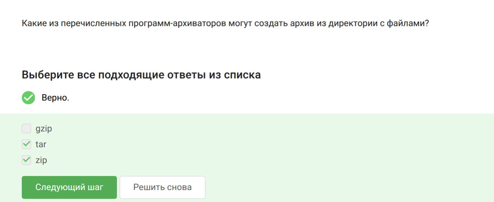{#fig:024 width=70%}

##

Для `.tar.bz2` нужны опции `-cjf`.

{#fig:025 width=70%}

# Поиск файлов и слов в файлах

##

Маски `alexey.*` и `*.jpg` не найдут `Alexey.jpeg`.

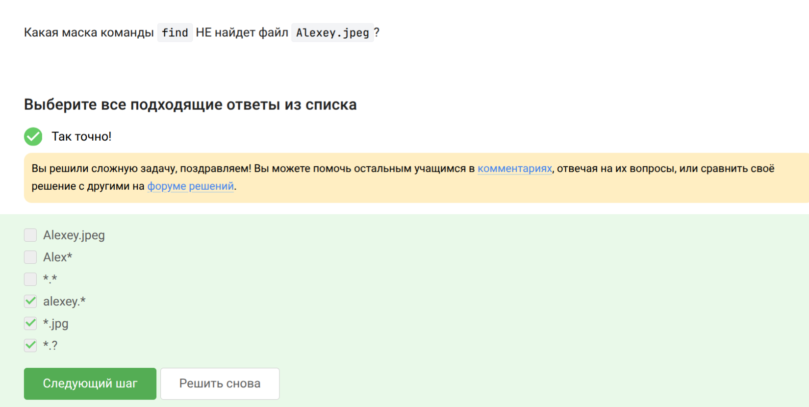{#fig:026 width=70%}

##

`grep` найдет строки с точным словом world.

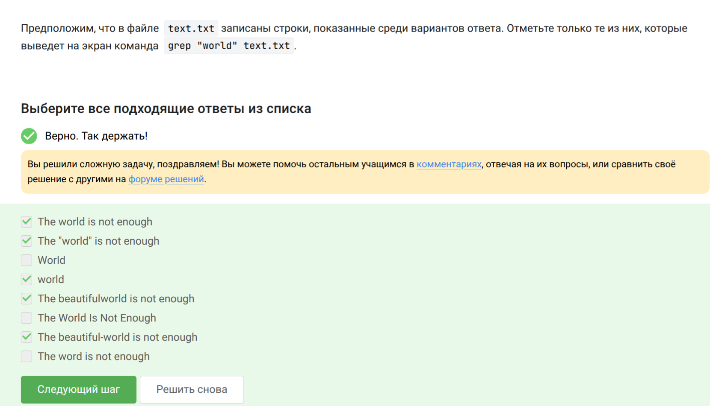{#fig:027 width=70%}

##

Команда `grep -rh <love> > love_lines.txt`.

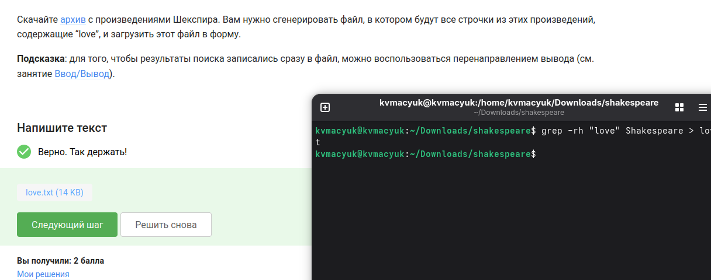{#fig:028 width=70%}

# Выводы

Прошел модуль 1 курса Stepik «Введение в Linux» и повторил основную информацию о работе в консоли.

# Список литературы

::: {#refs}
:::
