---
## Front matter
title: "Отчёт по модулю 1 курса ‘Stepik Введение в Linux’"
subtitle: "Дисциплина: Операционные системы"
author: "Мацюк Константин Владимирович"

## Generic otions
lang: ru-RU
toc-title: "Содержание"

## Bibliography
bibliography: bib/cite.bib
csl: pandoc/csl/gost-r-7-0-5-2008-numeric.csl

## Pdf output format
toc: true
toc-depth: 2
lof: true
lot: true
fontsize: 12pt
linestretch: 1.5
papersize: a4
documentclass: scrreprt
## I18n polyglossia
polyglossia-lang:
  name: russian
  options:
	- spelling=modern
	- babelshorthands=true
polyglossia-otherlangs:
  name: english
## I18n babel
babel-lang: russian
babel-otherlangs: english
## Fonts
mainfont: IBM Plex Serif
romanfont: IBM Plex Serif
sansfont: IBM Plex Sans
monofont: IBM Plex Mono
mathfont: STIX Two Math
mainfontoptions: Ligatures=Common,Ligatures=TeX,Scale=0.94
romanfontoptions: Ligatures=Common,Ligatures=TeX,Scale=0.94
sansfontoptions: Ligatures=Common,Ligatures=TeX,Scale=MatchLowercase,Scale=0.94
monofontoptions: Scale=MatchLowercase,Scale=0.94,FakeStretch=0.9
mathfontoptions:
## Biblatex
biblatex: true
biblio-style: "gost-numeric"
biblatexoptions:
  - parentracker=true
  - backend=biber
  - hyperref=auto
  - language=auto
  - autolang=other*
  - citestyle=gost-numeric
## Pandoc-crossref LaTeX customization
figureTitle: "Рис."
tableTitle: "Таблица"
listingTitle: "Листинг"
lofTitle: "Список иллюстраций"
lotTitle: "Список таблиц"
lolTitle: "Листинги"
## Misc options
indent: true
header-includes:
  - \usepackage{indentfirst}
  - \usepackage{float} # keep figures where there are in the text
  - \floatplacement{figure}{H} # keep figures where there are in the text
---

# Цель работы

Пройти курс «Введение в Linux» (модуль 1).

# Задание

Выполнить модуль 1

# Выполнение 1 модуля

## Общая информация

Ответил на первый вопрос о названии курса (рис. -@fig:001).

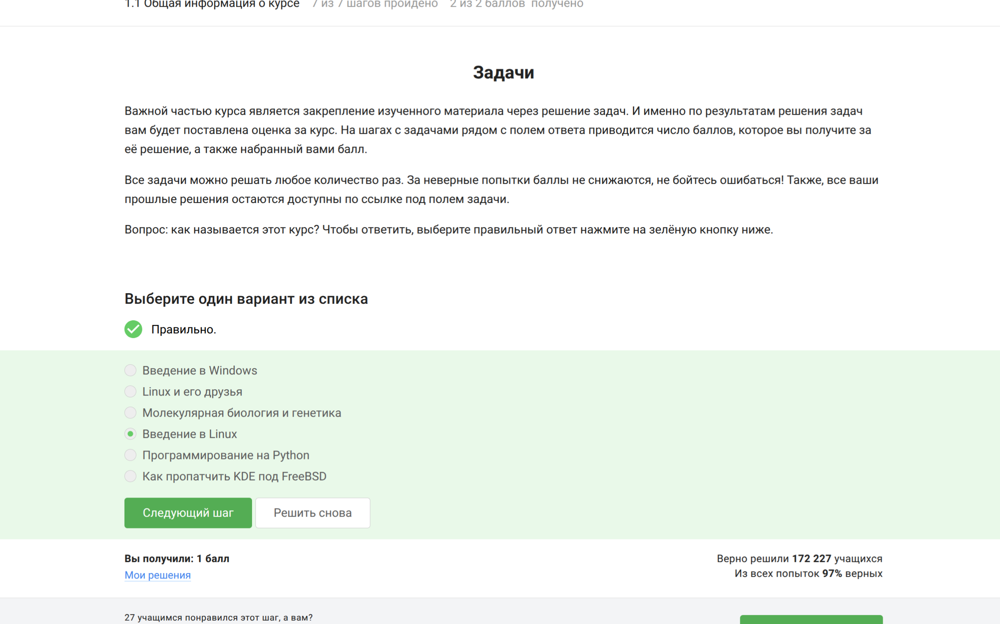{#fig:001 width=70%}

Далее - вопрос про общую информацию о курсе

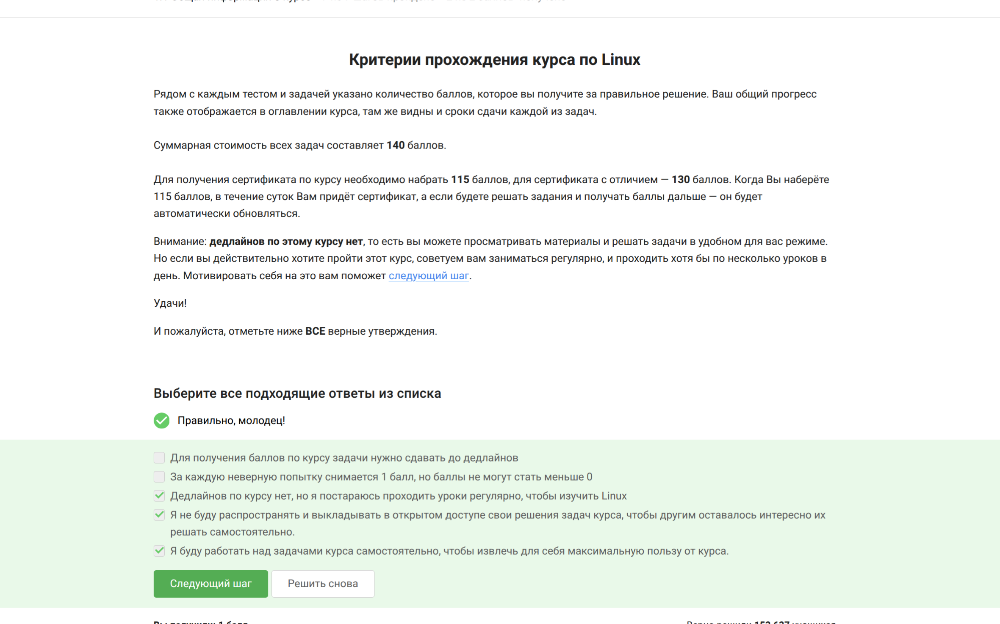{#fig:002 width=70%}

## Как установить Linux

Выбираю систему Windows, так как в повседневной жизни пользуюсь ей (рис. -@fig:003).

{#fig:003 width=70%}

Виртуальная машина позволяет запустить ОС внутри основной системы (рис. -@fig:004).

{#fig:004 width=70%}

Ответил да, т.к. уже пользовался системой Linux

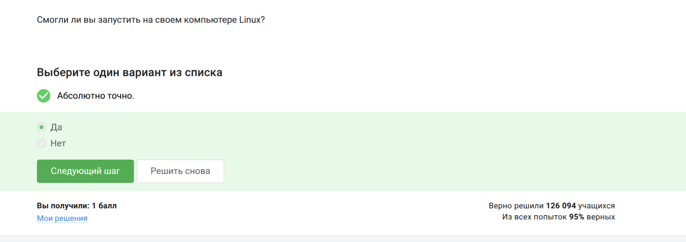{#fig:005 width=70%}

## Осваиваем Linux

Создаю XML файл со строкой Hello, Linux! в LibreOffice Writer (рис. -@fig:006)

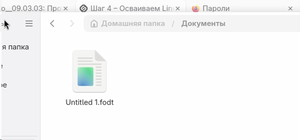{#fig:006 width=70%}

В Ubuntu пакеты имеют расширение deb (рис. -@fig:007).

{#fig:007 width=70%}

Первая фамилия в списке авторов VLC — Denis-Courmont (рис. -@fig:008).

{#fig:008 width=70%}

## Terminal: основы

Update Manager нужен для обновлений системы и программ.
Выбираю подходящие ответы (рис. -@fig:009):

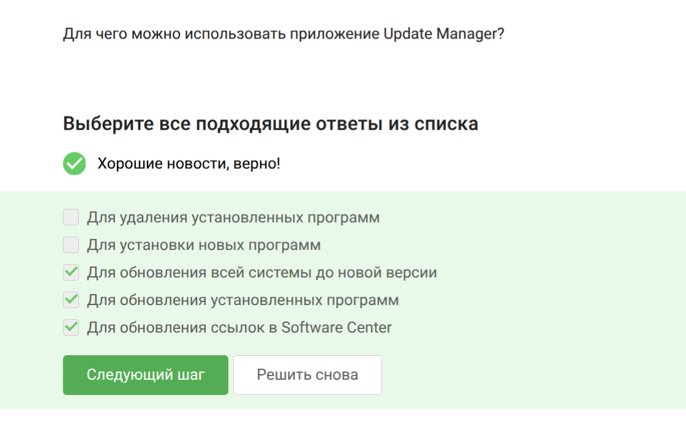{#fig:009 width=70%}

Терминал, консоль и командная строка — синонимы (рис. -@fig:010).

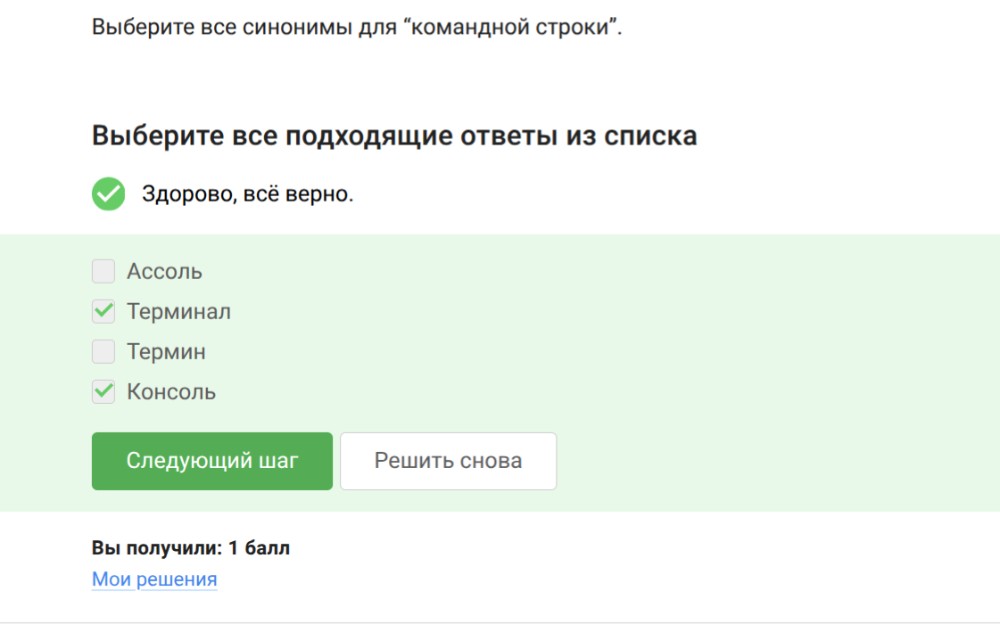{#fig:010 width=70%}

Только `pwd` (маленькими буквами) показывает текущую папку (рис. -@fig:011).

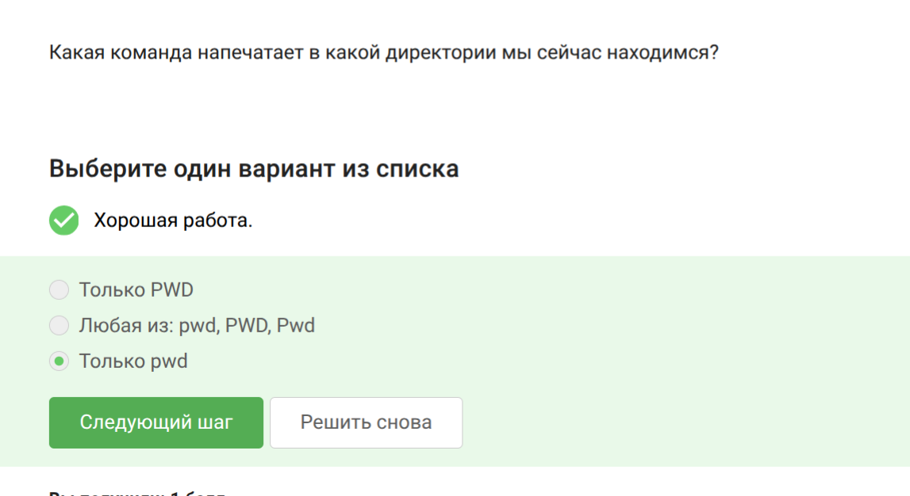{#fig:011 width=70%}

Все варианты эквивалентны, порядок опций не важен (рис. -@fig:012).

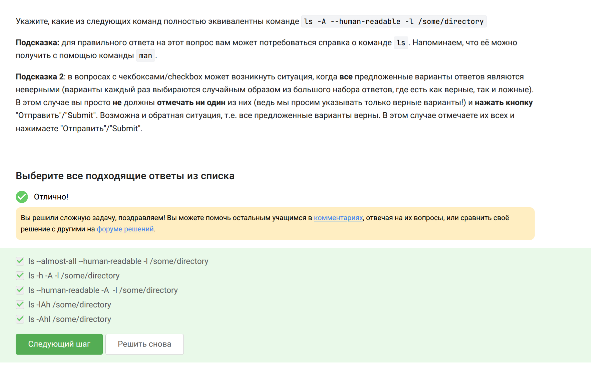{#fig:012 width=70%}

Директории удаляются командой `rm -r` (рис. -@fig:013).

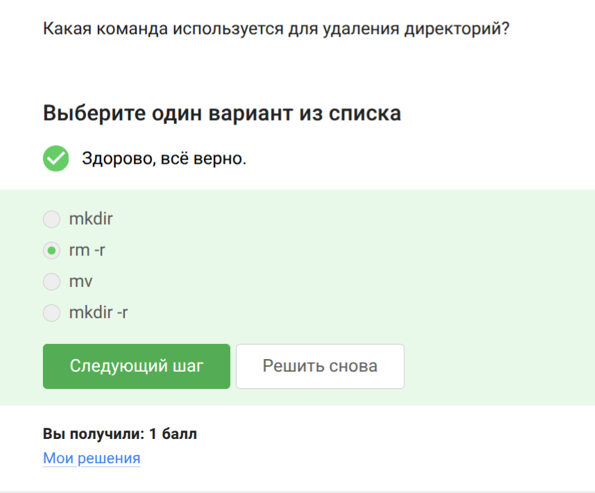{#fig:013 width=70%}

## Запуск исполняемых файлов

После `exit` терминал закроется, Firefox останется (рис. -@fig:012).

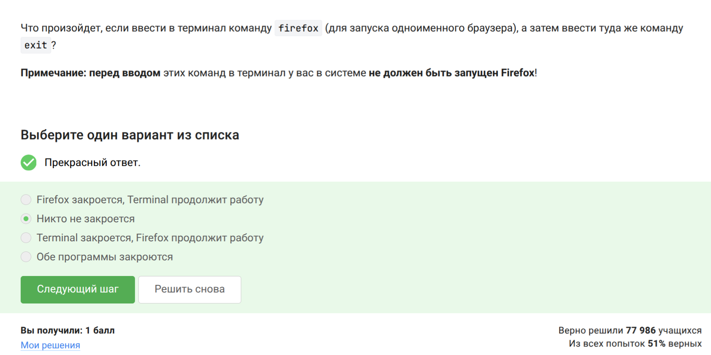{#fig:014 width=70%}

`&` эквивалентен запуску, `Ctrl+Z`, затем `bg` (рис. -@fig:013).

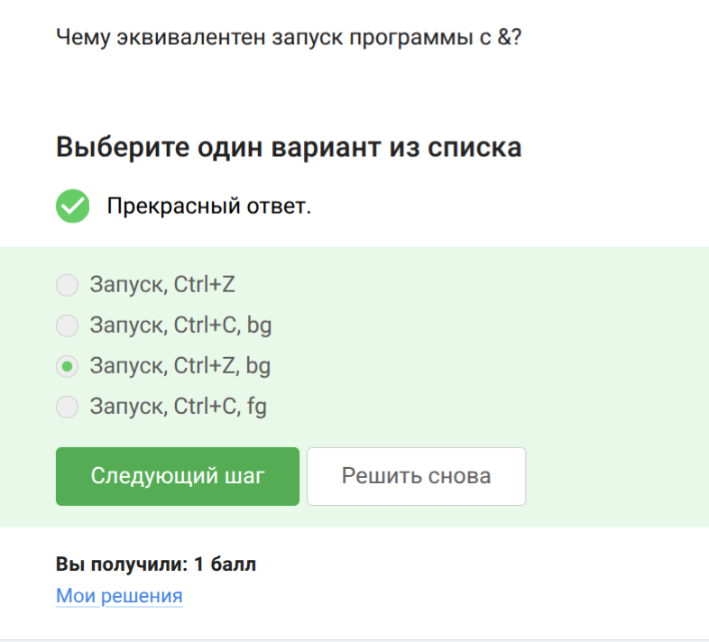{#fig:015 width=70%}

Скрипт вывел дату и контрольную сумму 954 (рис. -@fig:016).

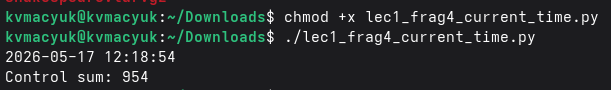{#fig:016 width=70%}

## Ввод / Вывод

Ошибки (stderr) по умолчанию выводятся на экран (рис. -@fig:017).

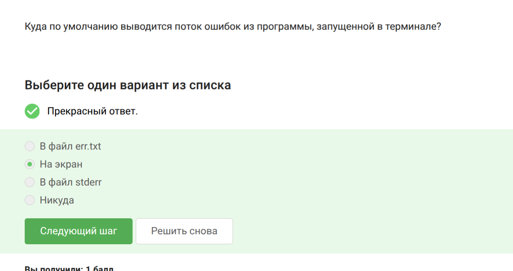{#fig:017 width=70%}

Надо использовать `2>` или `2>>` для перенаправления ошибок (рис. -@fig:016).

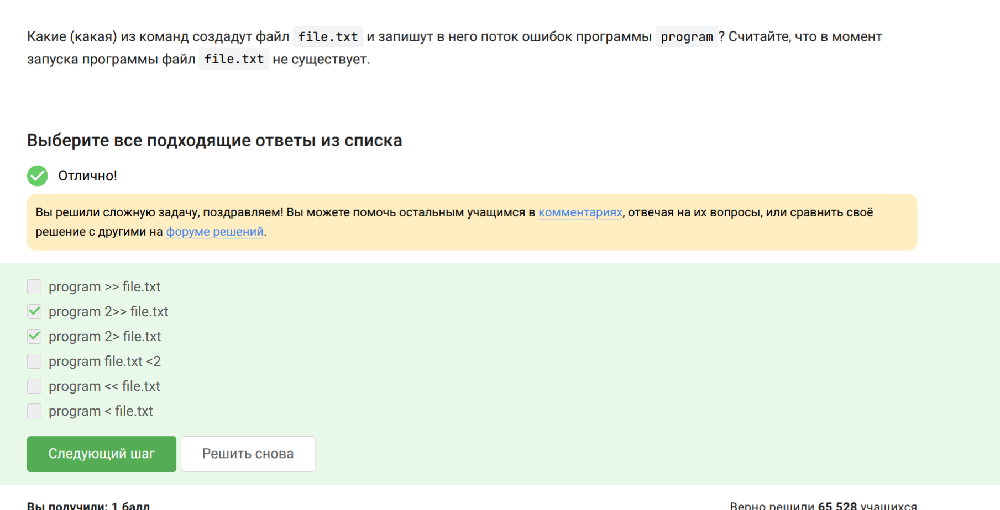{#fig:018 width=70%}

В конвейере (pipe) ошибки всё равно идут на экран (рис. -@fig:019).

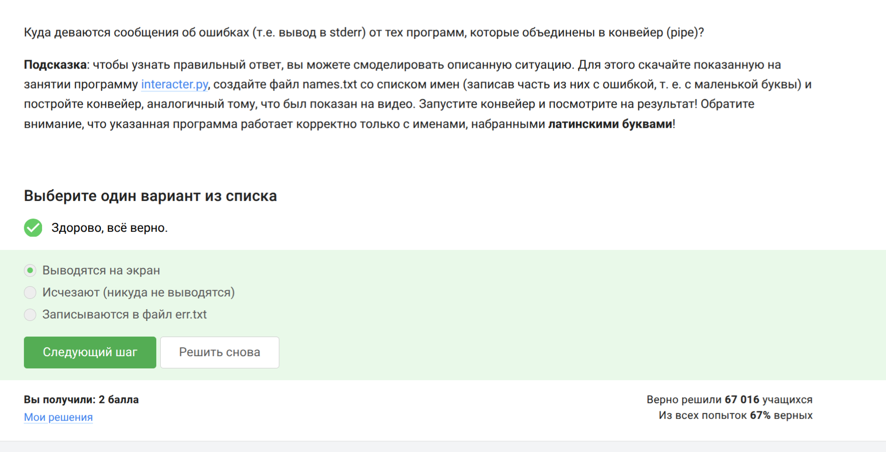{#fig:019 width=70%}

## Скачивание файлов

Файл сохранится как `/home/alex/1.jpg` (рис. -@fig:020).

{#fig:020 width=70%}

Опция `-q` (quiet) подавляет вывод сообщений (рис. -@fig:021).

{#fig:021 width=70%}

Скачаются jpg и html, но html потом удалятся (рис. -@fig:022).

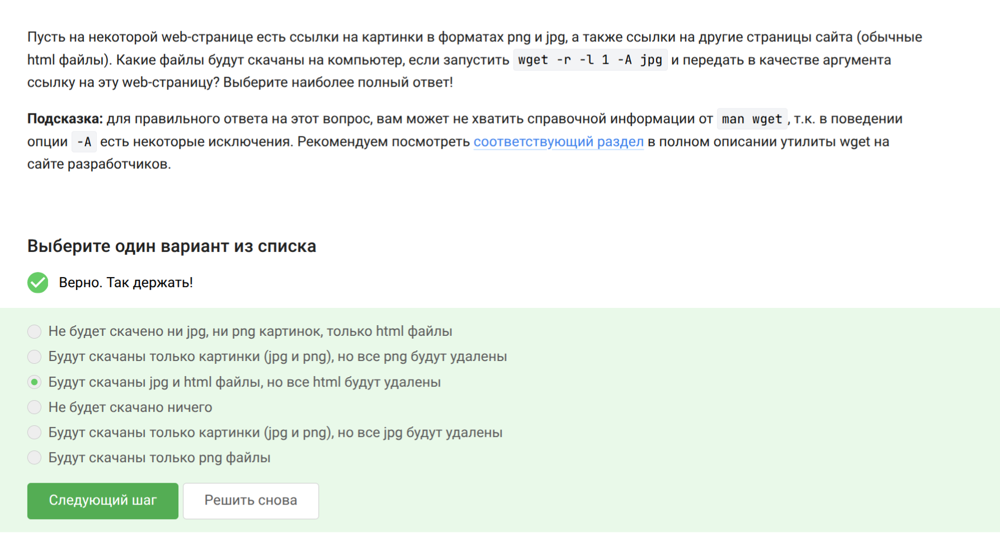{#fig:022 width=70%}

## Работа с архивами

`gzip` удаляет исходный архив после распаковки (рис. -@fig:023).

{#fig:023 width=70%}

`tar` и `zip` могут упаковать целую папку (рис. -@fig:022).

{#fig:024 width=70%}

Для `.tar.bz2` нужны опции `-cjf` (рис. -@fig:025).

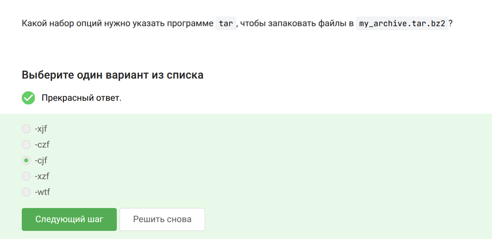{#fig:025 width=70%}

## Поиск файлов и слов в файлах

Маски `alexey.*` и `*.jpg` не найдут `Alexey.jpeg` (рис. -@fig:026).

{#fig:026 width=70%}

`grep` найдет строки с точным словом world (рис. -@fig:027).

{#fig:027 width=70%}

Команда `grep -rh <love> > love_lines.txt` (рис. -@fig:028).

{#fig:028 width=70%}

# Выводы

Прошел модуль 1 курса Stepik «Введение в Linux» и повторил основную информацию о работе в консоли

# Список литературы{.unnumbered}

::: {#refs}
:::
