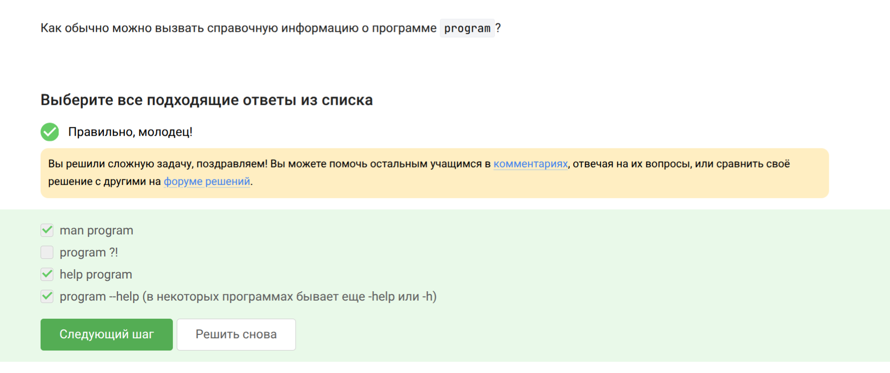
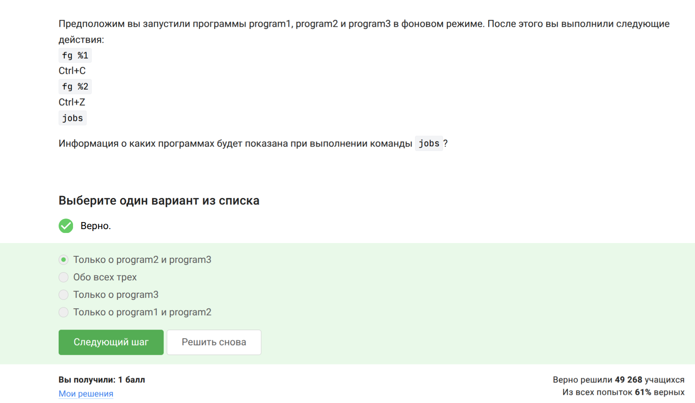
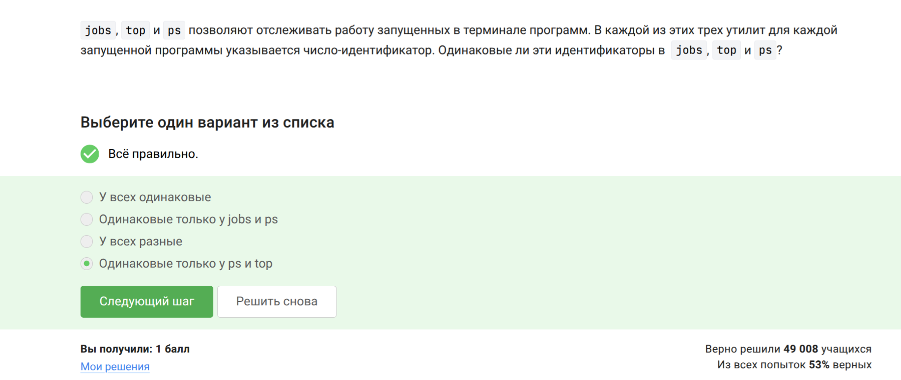
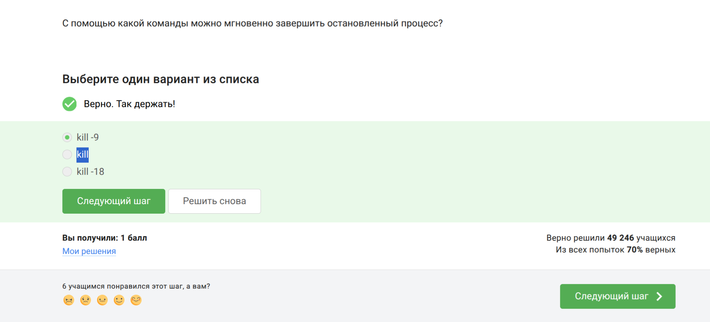
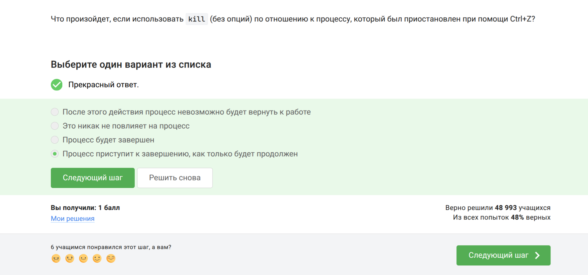
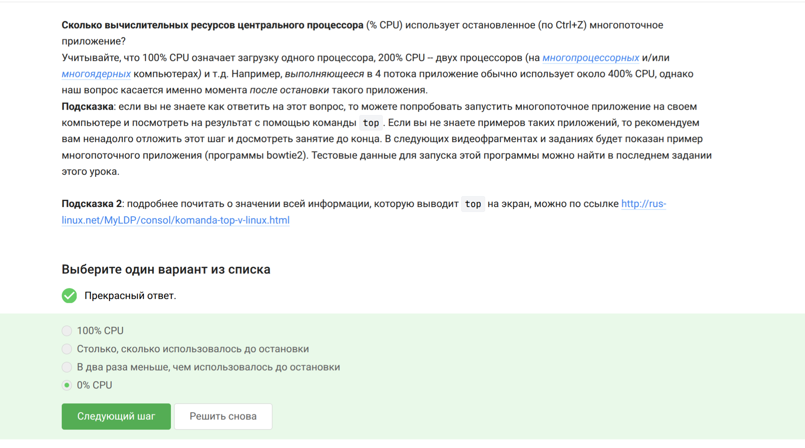
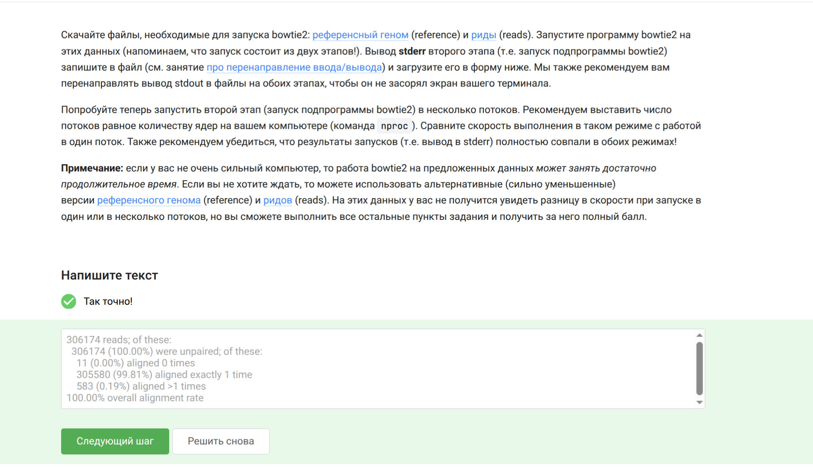
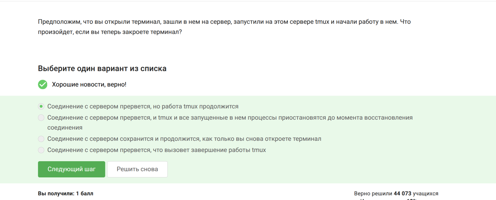
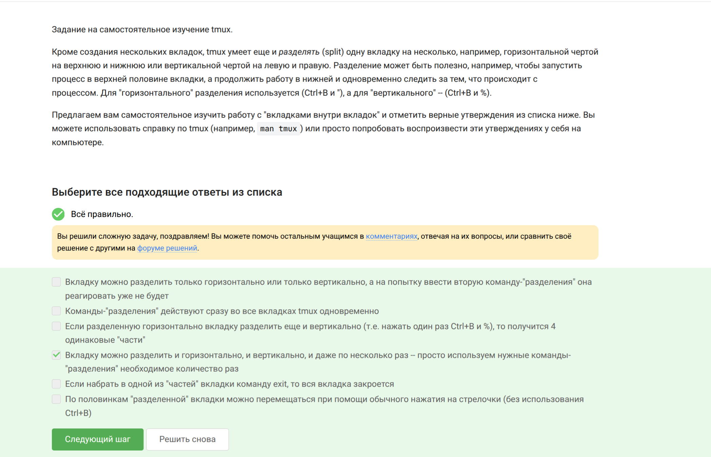

---
## Front matter
title: "Отчёт по модулю 2 курса ‘Stepik Введение в Linux’"
subtitle: "Дисциплина: Операционные системы"
author: "Мацюк Константин Владимирович"
institute: "Российский университет дружбы народов"
date: "2026"

## Generic options
lang: ru-RU

## Beamer options
theme: "metropolis"
colortheme: "default"
fonttheme: "default"
mainfont: "IBM Plex Serif"
sansfont: "IBM Plex Sans"
monofont: "IBM Plex Mono"
fontsize: 10pt
aspectratio: 169
section-titles: false
slide-level: 1
toc: false
section-titles: true
toc-depth: 1
header-includes:
  - \usepackage{float}
  - \usepackage{indentfirst}
---

## Содержание (1)

- Цель работы
- Задание
- Знакомство с сервером
- Обмен файлами
- Запуск приложений

## Содержание (2)

- Контроль запускаемых программ
- Многопоточные приложения
- Менеджер терминалов Tmux
- Выводы

# Цель работы

Пройти второй модуль курса «Введение в Linux» на платформе Stepik.

# Задание

Выполнить все задания модуля 2.

# Знакомство с сервером

Удалённый сервер может использоваться для хранения любых данных, выполнения вычислений и организации разного уровня доступа — верны все четыре варианта ответа.

{#fig:001 width=70%}

##

Открытый ключ (`id_rsa.pub`) не содержит секретной информации, поэтому его можно свободно передавать.

{#fig:002 width=70%}

# Обмен файлами

Для рекурсивного копирования директорий используется команда `scp -r stepic username@server:~/`.

{#fig:003 width=70%}

##

Перед установкой программы необходимо выполнить `sudo apt-get update`, чтобы обновить список пакетов.

{#fig:004 width=70%}

##

Программа Filezilla — это FTP-менеджер, позволяющий просматривать содержимое локального и удалённого компьютера, а также копировать файлы.

{#fig:005 width=70%}

# Запуск приложений

Если программа не запускается, можно проверить другую версию или настроить сервер для вывода графики.

{#fig:006 width=70%}

##

Справка по программе вызывается командами: `man program`, `help program`, `program --help`.

{#fig:007 width=70%}

##

FastQC принимает на вход форматы **fastq, bam, sam**.

{#fig:008 width=70%}

##

Для множественного выравнивания последовательностей в ClustalW используется команда `clustalw test.fasta -align`.

{#fig:009 width=70%}

# Контроль запускаемых программ

Программа, завершённая через `Ctrl+C`, не отображается в списке `jobs`. Приостановленная программа остаётся в списке.

{#fig:010 width=70%}

##

Команды `ps` и `top` показывают одни и те же процессы, тогда как `jobs` показывает только фоновые задачи текущей оболочки.

{#fig:011 width=70%}

##

Сигнал `SIGKILL (9)` принудительно завершает процесс мгновенно: `kill -9`.

{#fig:012 width=70%}

##

`kill` без опции отправляет сигнал `SIGTERM`, который обрабатывается после возобновления работы процесса.

{#fig:013 width=70%}

# Многопоточные приложения

Остановленное приложение не использует процессорное время (0% CPU).

{#fig:014 width=70%}

##

Столько, сколько оно потребляло в момент остановки, потому что остановка не освобождает память, она лишь приостанавливает выполнение.

{#fig:015 width=70%}

##

Никак, многопоточное приложение управляется как единый процесс, и завершить один поток без остановки всего процесса невозможно.

{#fig:016 width=70%}

##

Этап выравнивания можно распараллелить, а этап построения индекса выполняется в одном потоке.

{#fig:017 width=70%}

##

Программа bowtie2 выводит статистику (количество прочитанных ридов и процент выравнивания) через `stderr`.

{#fig:018 width=70%}

# Менеджер терминалов Tmux

Команда `fg` работает только с процессами текущей сессии; процесс, запущенный в другой вкладке, не будет найден.

{#fig:019 width=70%}

##

`exit` в последней вкладке завершает сессию tmux.

{#fig:020 width=70%}

##

Соединение с сервером прервется, работа tmux продолжится, так как он запускает отдельную серверную сессию.

{#fig:021 width=70%}

##

Закрытие вкладки tmux уничтожает все процессы внутри неё.

{#fig:022 width=70%}

##

Для переименования окна в tmux используется комбинация `Ctrl+B` и запятая.

{#fig:023 width=70%}

##

Tmux позволяет делить вкладку любое количество раз по горизонтали и вертикали.

{#fig:024 width=70%}

# Выводы

Я успешно прошёл модуль 2 курса «Введение в Linux» на платформе Stepik и освоил работу с удалённым сервером, передачу файлов, управление процессами, многопоточность и менеджер терминалов tmux.

# Список литературы

::: {#refs}
:::
