---
## Front matter
title: "Отчёт по модулю 2 курса ‘Stepik Введение в Linux’"
subtitle: "Дисциплина: Операционные системы"
author: "Мацюк Константин Владимирович"

## Generic otions
lang: ru-RU
toc-title: "Содержание"

## Bibliography
bibliography: bib/cite.bib
csl: pandoc/csl/gost-r-7-0-5-2008-numeric.csl

## Pdf output format
toc: true
toc-depth: 2
lof: true
lot: true
fontsize: 12pt
linestretch: 1.5
papersize: a4
documentclass: scrreprt
## I18n polyglossia
polyglossia-lang:
  name: russian
  options:
	- spelling=modern
	- babelshorthands=true
polyglossia-otherlangs:
  name: english
## I18n babel
babel-lang: russian
babel-otherlangs: english
## Fonts
mainfont: IBM Plex Serif
romanfont: IBM Plex Serif
sansfont: IBM Plex Sans
monofont: IBM Plex Mono
mathfont: STIX Two Math
mainfontoptions: Ligatures=Common,Ligatures=TeX,Scale=0.94
romanfontoptions: Ligatures=Common,Ligatures=TeX,Scale=0.94
sansfontoptions: Ligatures=Common,Ligatures=TeX,Scale=MatchLowercase,Scale=0.94
monofontoptions: Scale=MatchLowercase,Scale=0.94,FakeStretch=0.9
mathfontoptions:
## Biblatex
biblatex: true
biblio-style: "gost-numeric"
biblatexoptions:
  - parentracker=true
  - backend=biber
  - hyperref=auto
  - language=auto
  - autolang=other*
  - citestyle=gost-numeric
## Pandoc-crossref LaTeX customization
figureTitle: "Рис."
tableTitle: "Таблица"
listingTitle: "Листинг"
lofTitle: "Список иллюстраций"
lotTitle: "Список таблиц"
lolTitle: "Листинги"
## Misc options
indent: true
header-includes:
  - \usepackage{indentfirst}
  - \usepackage{float} # keep figures where there are in the text
  - \floatplacement{figure}{H} # keep figures where there are in the text
---

# Цель работы

Пройти второй модуль курса «Введение в Linux» на платформе Stepik.

# Задание

Выполнить все задания модуля 2.

# Выполнение модуля 2

## Знакомство с сервером

Удалённый сервер может использоваться для хранения любых данных, выполнения вычислений и организации разного уровня доступа — верны все четыре варианта ответа. (рис. -@fig:001)

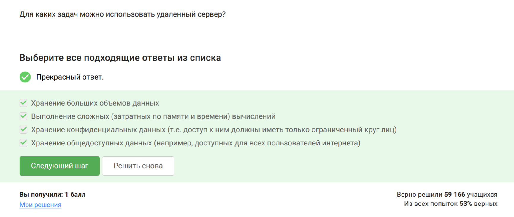{#fig:001 width=70%}

Открытый ключ (`id_rsa.pub`) не содержит секретной информации, поэтому его можно свободно передавать (рис. -@fig:002).

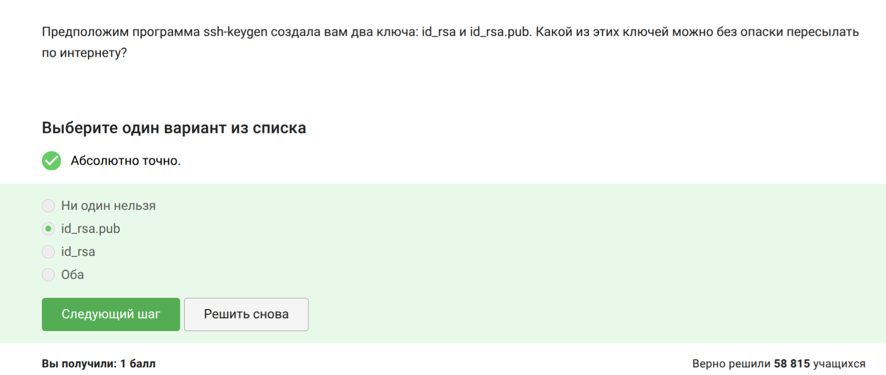{#fig:002 width=70%}

## Обмен файлами

Для рекурсивного копирования директорий используется команда `scp -r stepic username@server:~/` (рис. -@fig:003).

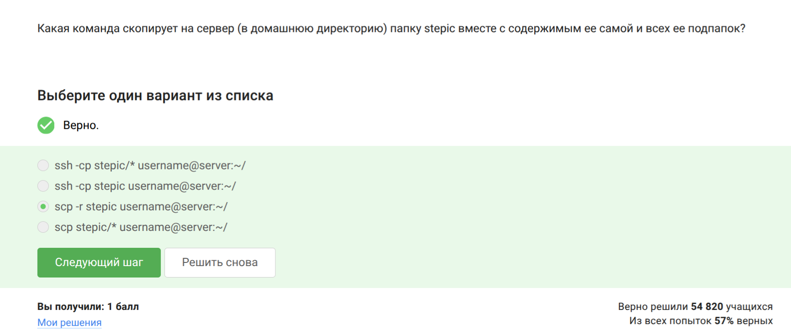{#fig:003 width=70%}

Перед установкой программы необходимо выполнить `sudo apt-get update`, чтобы обновить список пакетов (рис. -@fig:004).

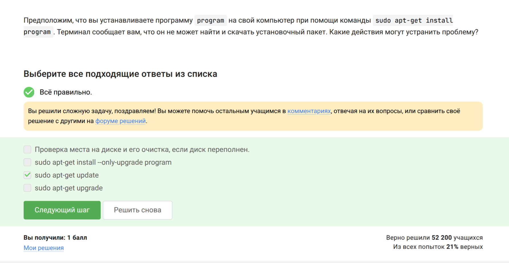{#fig:004 width=70%}

Программа Filezilla — это FTP-менеджер, позволяющий просматривать содержимое локального и удалённого компьютера, а также копировать файлы (рис. -@fig:005).

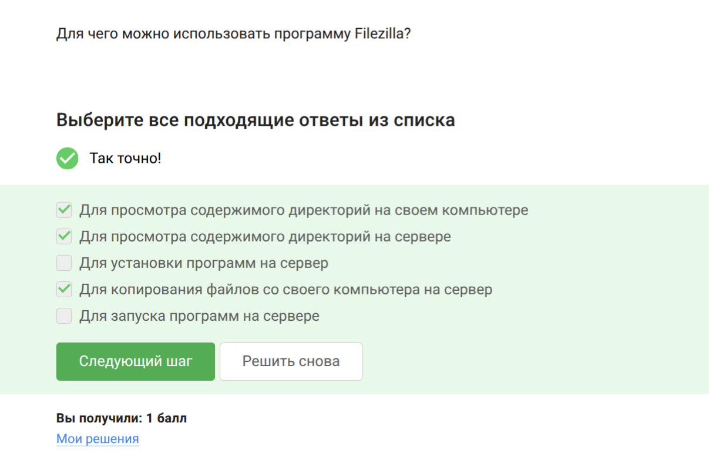{#fig:005 width=70%}

## Запуск приложений

Если программа не запускается, можно проверить другую версию или настроить сервер для вывода графики (рис. -@fig:006).

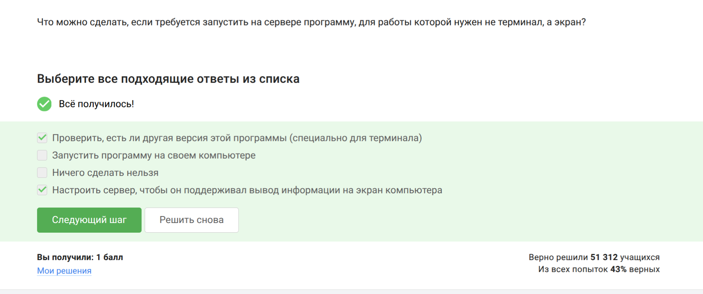{#fig:006 width=70%}

Справка по программе вызывается командами: `man program`, `help program`, `program --help` (рис. -@fig:007).

{#fig:007 width=70%}

FastQC принимает на вход форматы **fastq, bam, sam** (рис. -@fig:008).

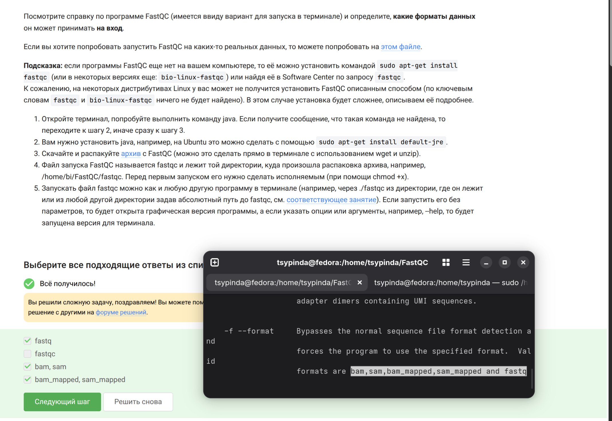{#fig:008 width=70%}

Для множественного выравнивания последовательностей в ClustalW используется команда `clustalw test.fasta -align` (рис. -@fig:009).

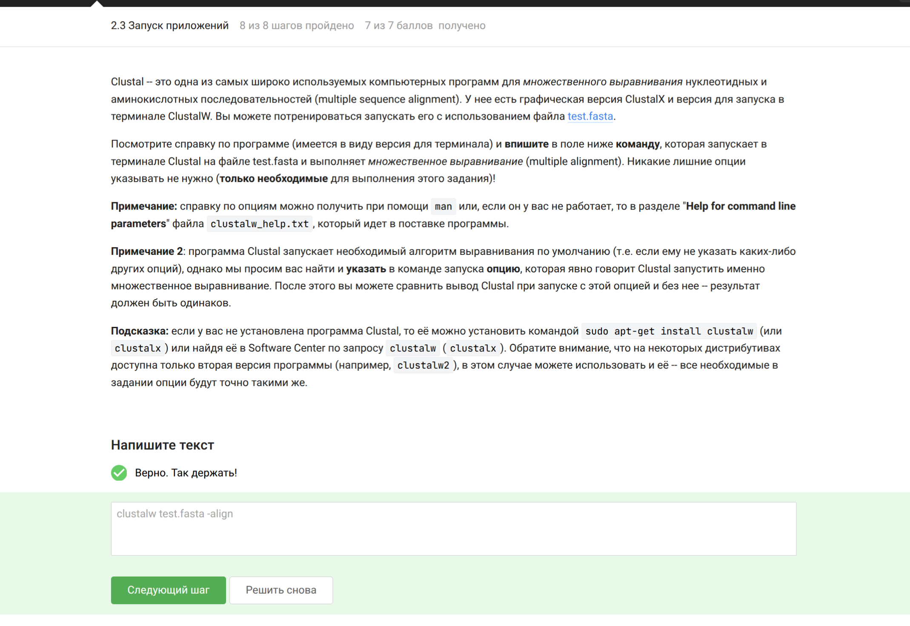{#fig:009 width=70%}

## Контроль запускаемых программ

Программа, завершённая через `Ctrl+C`, не отображается в списке `jobs`. Приостановленная программа остаётся в списке (рис. -@fig:010).

{#fig:010 width=70%}

Команды `ps` и `top` показывают одни и те же процессы, тогда как `jobs` показывает только фоновые задачи текущей оболочки (рис. -@fig:011).

{#fig:011 width=70%}

Сигнал `SIGKILL (9)` принудительно завершает процесс мгновенно: `kill -9` (рис. -@fig:012).

{#fig:012 width=70%}

`kill` без опции отправляет сигнал `SIGTERM`, который обрабатывается после возобновления работы процесса (рис. -@fig:013).

{#fig:013 width=70%}

## Многопоточные приложения

Остановленное приложение не использует процессорное время (0% CPU) (рис. -@fig:014).

{#fig:014 width=70%}

Столько, сколько оно потребляло в момент остановки, потому что остановка не освобождает память, она лишь приостанавливает выполнение (рис. -@fig:015).

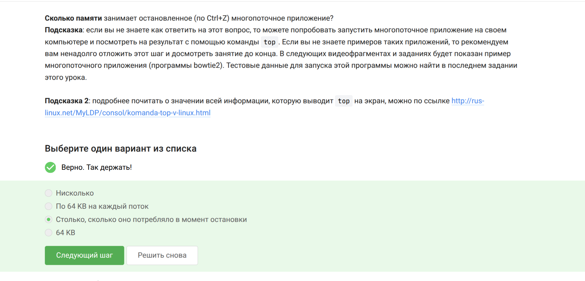{#fig:015 width=70%}

Никак, многопоточное приложение управляется как единый процесс, и завершить один поток без остановки всего процесса невозможно. (рис. -@fig:016)

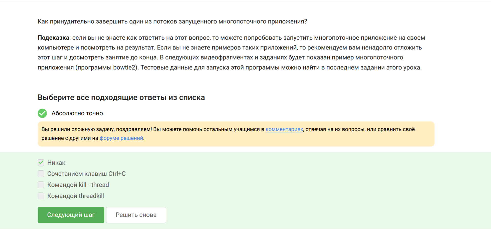{#fig:016 width=70%}

Этап выравнивания можно распараллелить, а этап построения индекса выполняется в одном потоке (рис. -@fig:017).

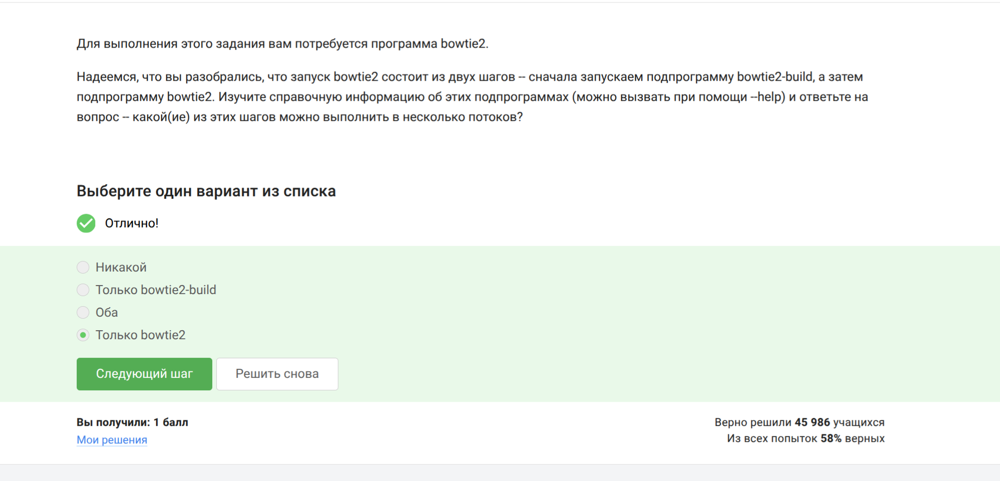{#fig:017 width=70%}

Программа bowtie2 выводит статистику (количество прочитанных ридов и процент выравнивания) через `stderr` (рис. -@fig:018).

{#fig:018 width=70%}

## Менеджер терминалов Tmux

Команда `fg` работает только с процессами текущей сессии; процесс, запущенный в другой вкладке, не будет найден (рис. -@fig:019).

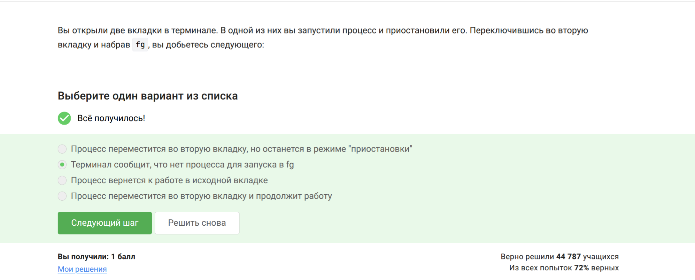{#fig:019 width=70%}

`exit` в последней вкладке завершает сессию tmux (рис. -@fig:020).

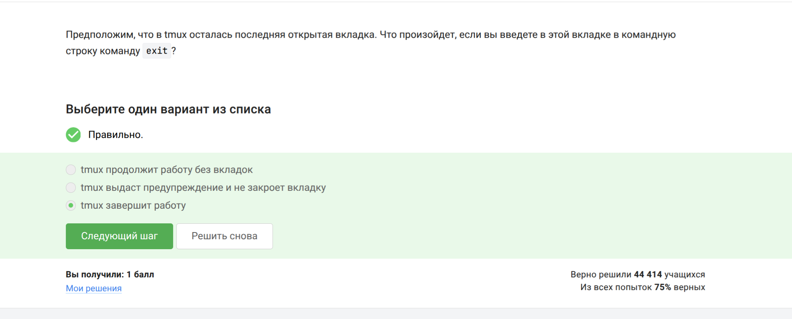{#fig:020 width=70%}

Соединение с сервером прервется, работа tmux продолжится, так как он запускает отдельную серверную сессию (рис. -@fig:021).

{#fig:021 width=70%}

Закрытие вкладки tmux уничтожает все процессы внутри неё (рис. -@fig:022).

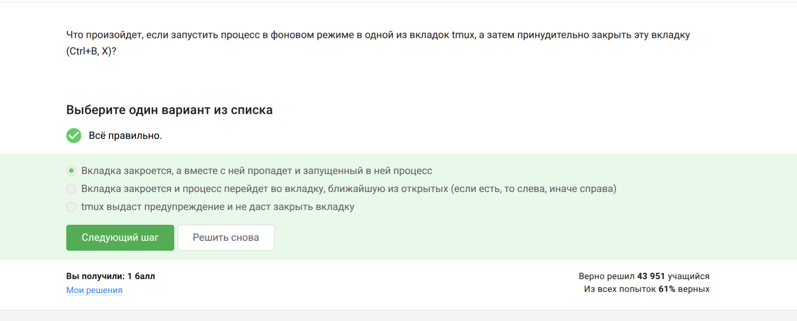{#fig:022 width=70%}

Для переименования окна в tmux используется комбинация `Ctrl+B` и запятая (рис. -@fig:023).

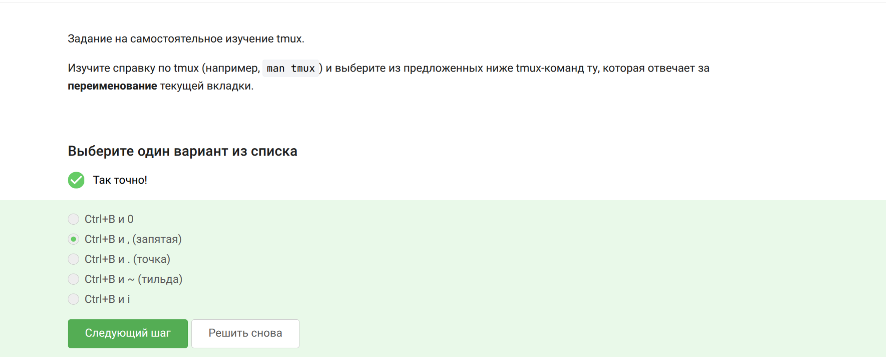{#fig:023 width=70%}

Tmux позволяет делить вкладку любое количество раз по горизонтали и вертикали (рис. -@fig:024).

{#fig:024 width=70%}

# Выводы

Я успешно прошёл модуль 2 курса «Введение в Linux» на платформе Stepik и освоил работу с удалённым сервером, передачу файлов, управление процессами, многопоточность и менеджер терминалов tmux.

# Список литературы{.unnumbered}

::: {#refs}
:::
