---
## Front matter
title: "Отчёт по модулю 3 курса ‘Stepik Введение в Linux’"
subtitle: "Дисциплина: Операционные системы"
author: "Мацюк Константин Владимирович"
institute: "Российский университет дружбы народов"
date: "2026"

## Generic options
lang: ru-RU

## Beamer options
theme: "metropolis"
colortheme: "default"
fonttheme: "default"
mainfont: "IBM Plex Serif"
sansfont: "IBM Plex Sans"
monofont: "IBM Plex Mono"
fontsize: 10pt
aspectratio: 169
section-titles: false
slide-level: 1
toc: false
section-titles: true
toc-depth: 1
header-includes:
  - \usepackage{float}
  - \usepackage{indentfirst}
---

## Содержание (1)

- Цель работы
- Задание
- Текстовый редактор vim
- Скрипты на bash: основы
- Скрипты на bash: ветвления и циклы

## Содержание (2)

- Скрипты на bash: разное
- Продвинутый поиск и редактирование
- Строим графики в gnuplot
- Разное
- Выводы

# Цель работы

Пройти курс «Введение в Linux» (модуль 3).

# Задание

Выполнить модуль 3.

# Текстовый редактор vim

##

Для выхода из редактора vim после открытия файла нужно нажать клавишу `:`, затем `q` и `Enter`.

{#fig:001 width=70%}

##

`word` состоит из букв, цифр и подчёркиваний, а `WORD` — из любых непробельных символов. Нажатие `w` не может остановиться на точке, а для достижения конца строки требуется меньше нажатий `W`, чем `w`.

{#fig:002 width=70%}

##

Использованы команды: `x2wwywPr` — удаление слова «one», перемещение и вставка; `d2wwywPr` — аналогично с удалением двух слов; `ddithree four four four five` — удаление строки и вставка новой; `d2wwifour four` — удаление до «three» и вставка «four four».

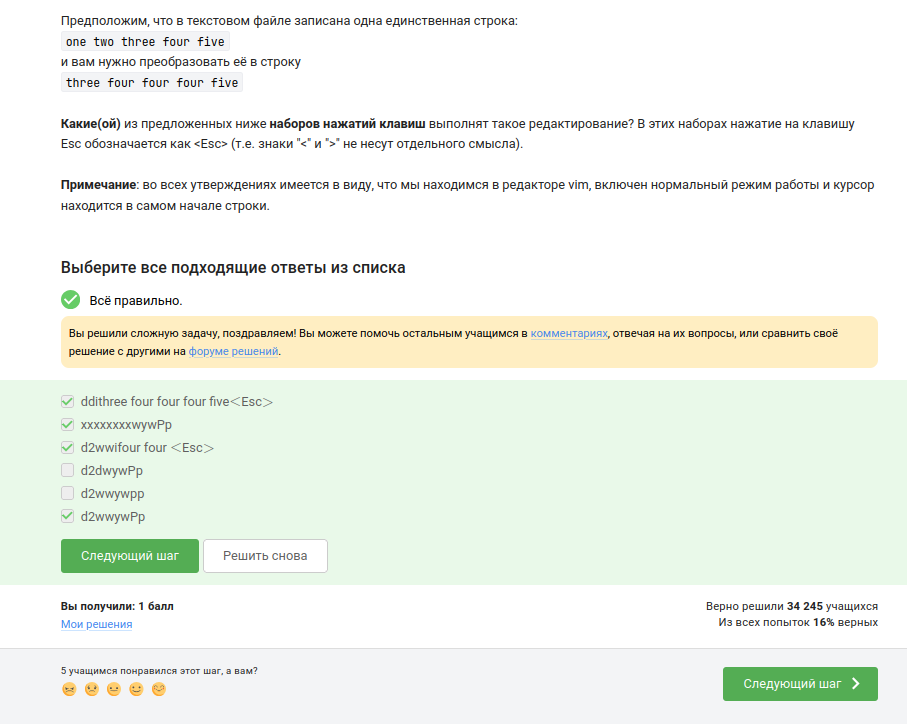{#fig:003 width=70%}

##

`:%s/Windows/Linux/` выполняет глобальную замену первого вхождения.

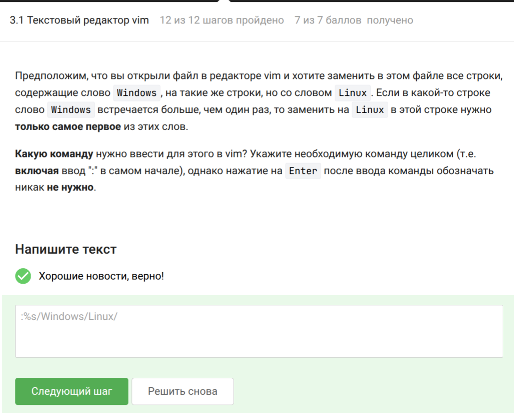{#fig:004 width=70%}

##

В режиме Visual доступны команды перемещения, а также команды `d` (удалить) и `y` (скопировать).

{#fig:005 width=70%}

# Скрипты на bash: основы

##

Каждая оболочка bash имеет свою собственную историю команд. Во вложенной оболочке будут доступны только команды, введённые в ней (набор C).

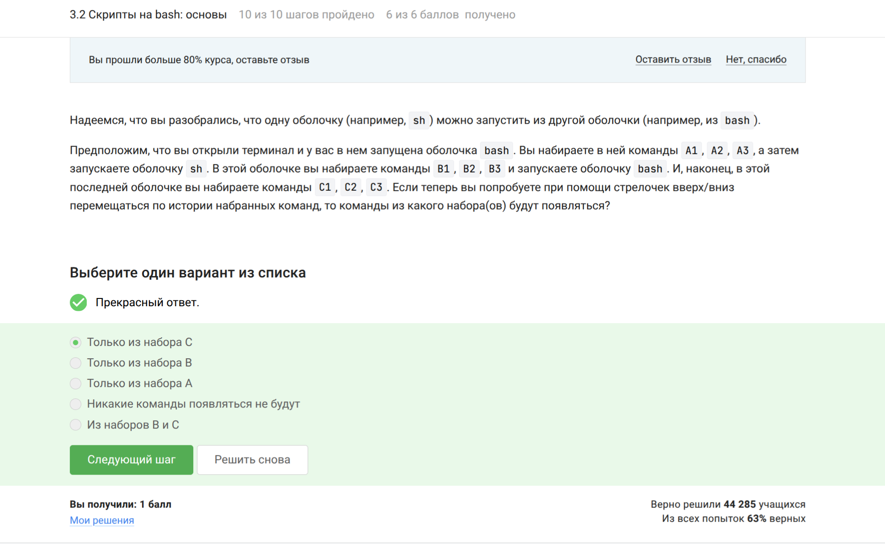{#fig:006 width=70%}

##

Скрипт сначала переходит в `/home/bi/`, затем создаёт файл `file1.txt`. Абсолютный путь к созданному файлу – `/home/bi/file1.txt`.

{#fig:007 width=70%}

##

Скрипт выводит строку с подстановкой аргументов. Знак доллара перед `$1` экранируется, чтобы напечатать литерал. При запуске `./script.sh one two` на экране появится `Arguments are: $1=one $2=two`.

{#fig:008 width=70%}

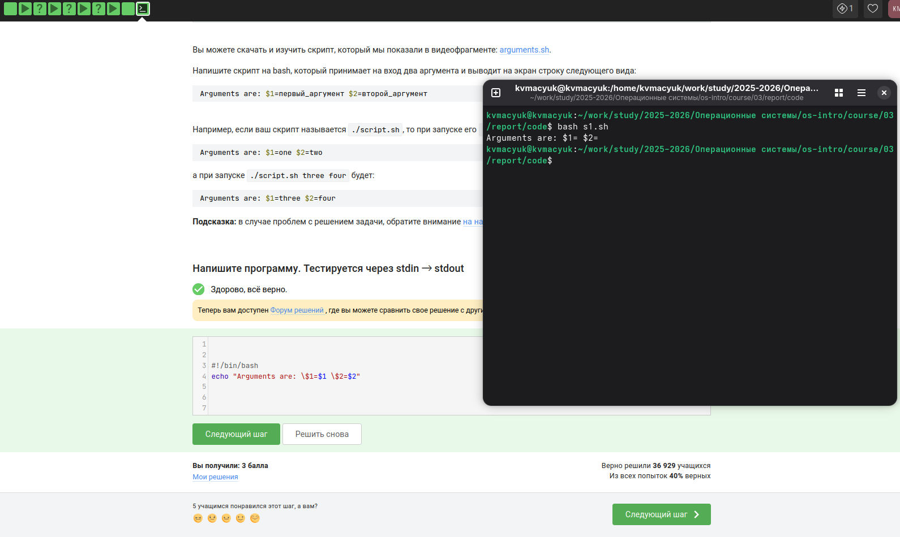{#fig:009 width=70%}

# Скрипты на bash: ветвления и циклы

##

Условия `5 -ge 5` и `-z " "` всегда истинны независимо от параметров скрипта и значений переменных.

{#fig:010 width=70%}

##

При `var=3` и `var=5` ни одно из условий не выполняется, поэтому оба раза будет напечатано «four».

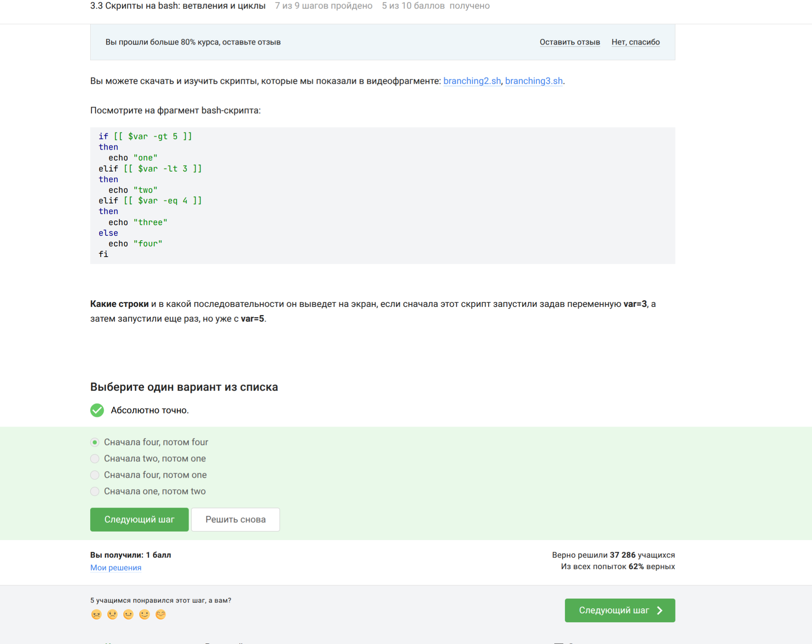{#fig:011 width=70%}

##

Скрипт анализирует первый аргумент `$1` и выводит соответствующее сообщение. Для диапазона 2-4 важно использовать условие `-lt 5`.

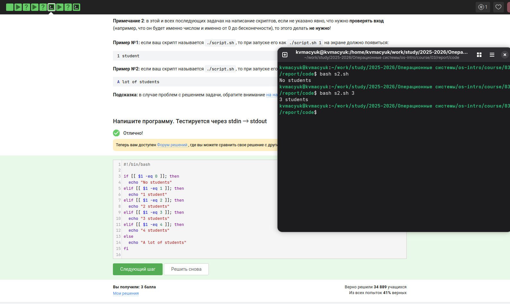{#fig:012 width=70%}

##

Цикл `for` перебирает три элемента. Команда `continue` пропускает вывод «finish» для строк, лексикографически больших «c». «start» появится 5 раз, а «finish» — 4 раза.

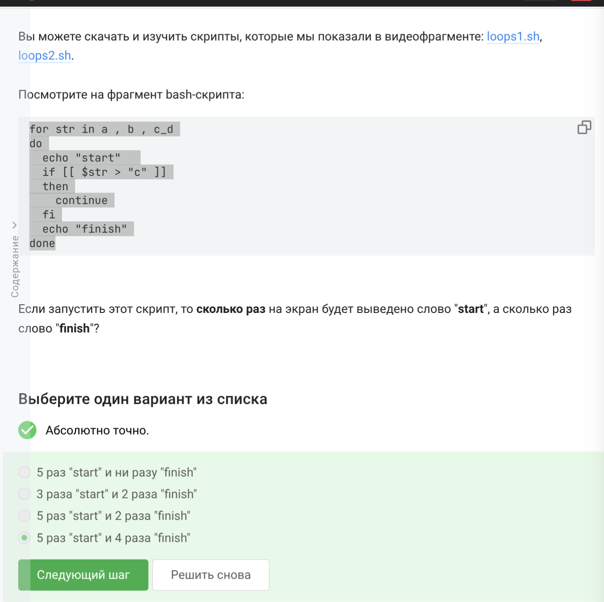{#fig:013 width=70%}

##

Скрипт в бесконечном цикле читает имя и возраст. Если имя пустое или возраст равен 0, выводится «bye» и цикл прерывается. Иначе определяется возрастная группа.

{#fig:014 width=70%}

# Скрипты на bash: разное

##

Команда `let` выполняет арифметические операции.

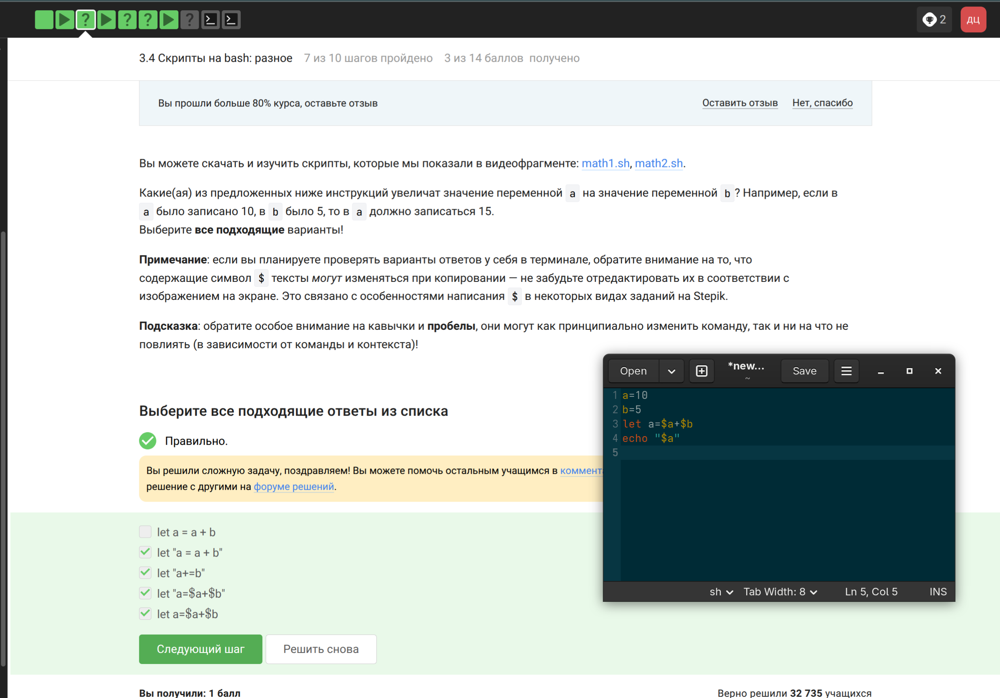{#fig:015 width=70%}

##

Обратные кавычки выполняют команду `pwd`. После `cd /home/bi/` текущим становится `/home/bi`, поэтому `echo` выводит `/home/bi`.

{#fig:016 width=70%}

##

Чтобы проверить код возврата программы, её нужно запустить отдельно, а затем проверить переменную `$?`. Нельзя использовать `if program`, так как это подставит вывод, а не код возврата.

{#fig:017 width=70%}

##

В функции `counter` переменная `c1` объявлена как `local`, поэтому не сохраняет значение. `c2` накапливает сумму: после десяти вызовов `echo` выводит «counters are and 110».

{#fig:018 width=70%}

##

Функция `gcd` реализует алгоритм Евклида. Основная программа читает пары чисел и вызывает `gcd`. При пустой строке выводится «bye» и выполнение прекращается.

{#fig:019 width=70%}

##

Программа-калькулятор читает строки в цикле. При вводе «exit» выводится «bye» и цикл прерывается. Иначе пытается вычислить выражение через `let`. При ошибке выводится «ergor» и скрипт завершается.

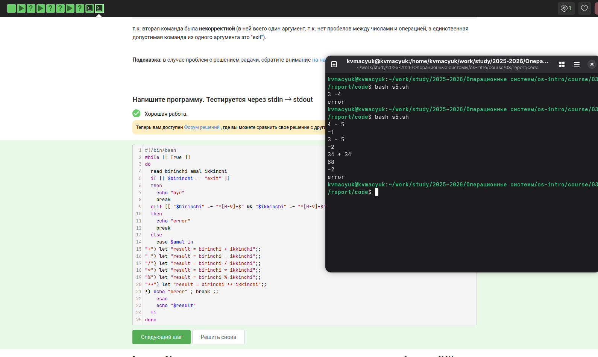{#fig:020 width=70%}

# Продвинутый поиск и редактирование

##

Опция `-iname` игнорирует регистр. Команда `find -iname "star*"` найдёт все четыре файла, начинающихся на Star/STAR/star.

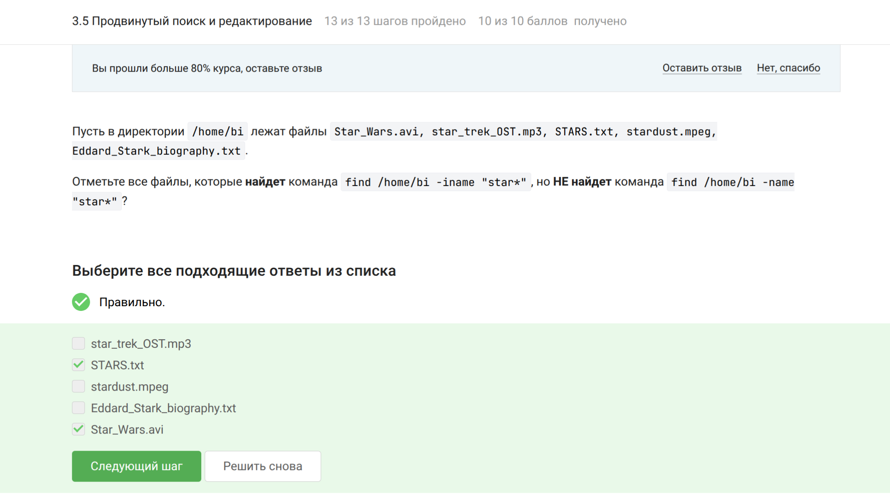{#fig:021 width=70%}

##

Опции `-path` и `-name` отличаются: `-path` сопоставляет весь путь, а `-name` только имя файла. Утверждение «Если заменить `-name` на `-path`, результат поиска иногда может остаться таким же» верно.

{#fig:022 width=70%}

##

Все варианты `grep` выводят одинаковое количество строк, так как каждая строка файла содержит искомое слово. В итоге все команды создадут файл `results.txt` одинакового размера.

{#fig:023 width=70%}

##

Регулярное выражение ищет строки, заканчивающиеся определённым образом.

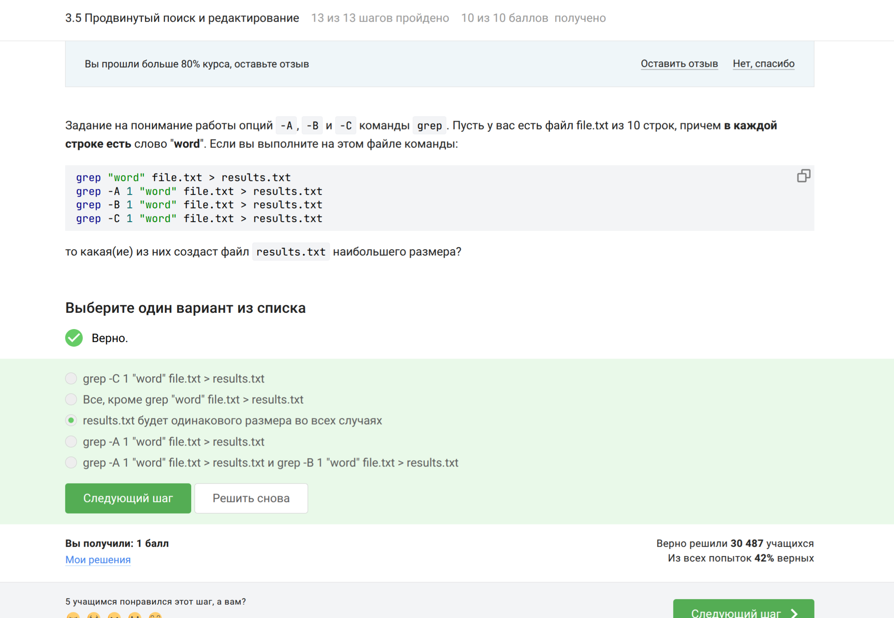{#fig:024 width=70%}

##

Без опции `-n` `sed` печатает каждую строку по умолчанию, а команда `p` — ещё раз. Строки, соответствующие шаблону, будут выведены дважды, остальные — один раз.

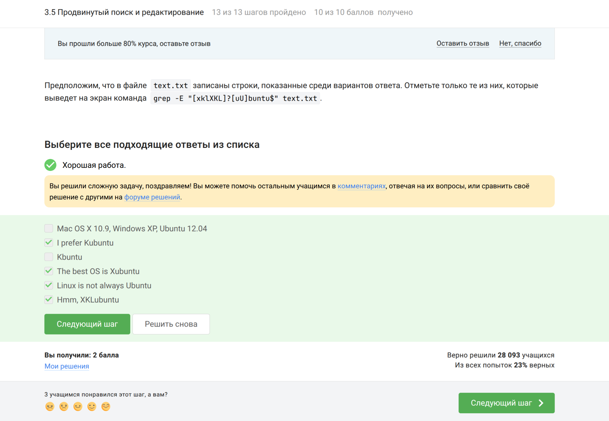{#fig:025 width=70%}

##

Инструкция `sed 's/ [A-Z][A-Z]+ / abbreviation /g'` заменяет последовательности из двух и более заглавных букв на слово `abbreviation`.

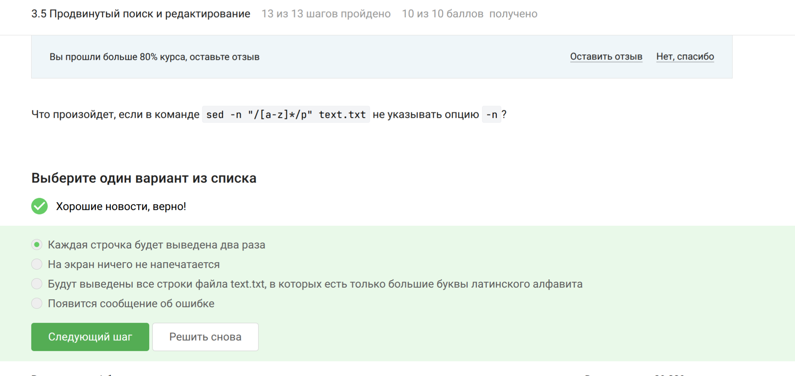{#fig:026 width=70%}

# Строим графики в gnuplot

##

Опция `-p` (`--persist`) при запуске gnuplot предотвращает закрытие окон с графиками после завершения работы программы.

{#fig:027 width=70%}

##

При использовании `set key autotitle columnhead` и отсутствии заголовков, название ряда берётся из первого значения второго столбца. Всего будет нарисовано 9 точек, так как первая строка использована для названия.

{#fig:028 width=70%}

##

Команда `set xtics` создаёт пользовательские деления на оси X с помощью конкатенации строк.

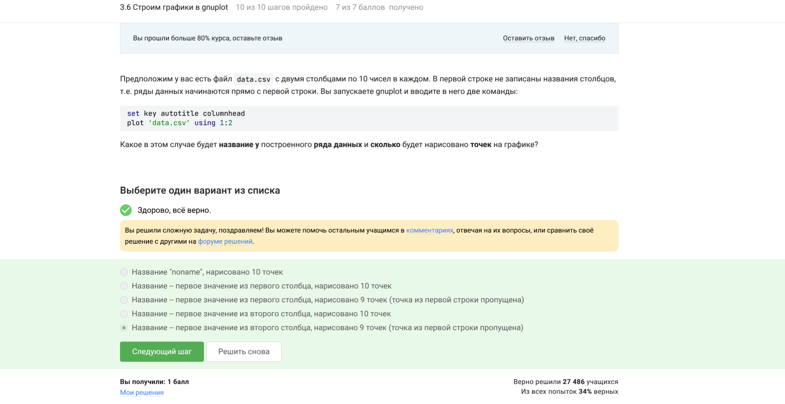{#fig:029 width=70%}

##

Для отражения графика функция изменена на `-x2-y2`. Обратное вращение достигается изменением приращения угла, а ускорение — уменьшением паузы до 0.1 секунды.

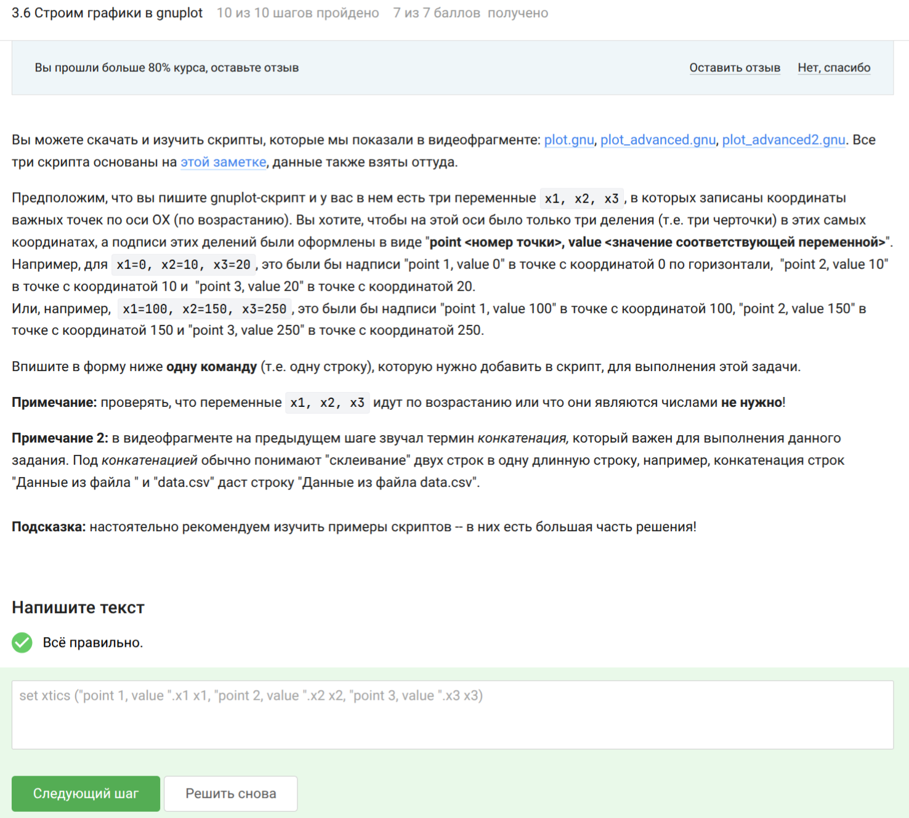{#fig:030 width=70%}

# Разное

##

Права `rwxr-xr--` соответствуют числовому значению 764.

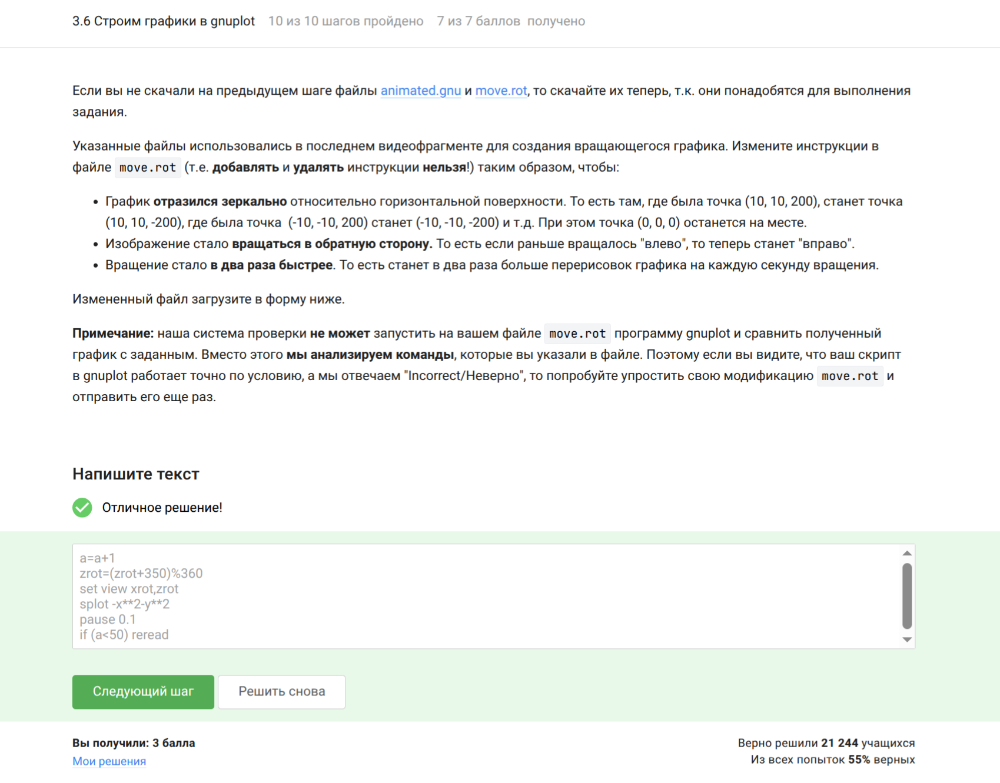{#fig:031 width=70%}

##

Чтобы пользователь `user` из группы `group` мог создавать файлы в директории, нужно сменить владельца или добавить право записи с помощью `sudo`.

{#fig:032 width=70%}

##

Команда `wc` может подсчитать количество байт, слов и символов. Она не умеет считать предложения или отдельные буквы.

{#fig:033 width=70%}

##

Команда `du -sh` выводит суммарный размер текущей директории.

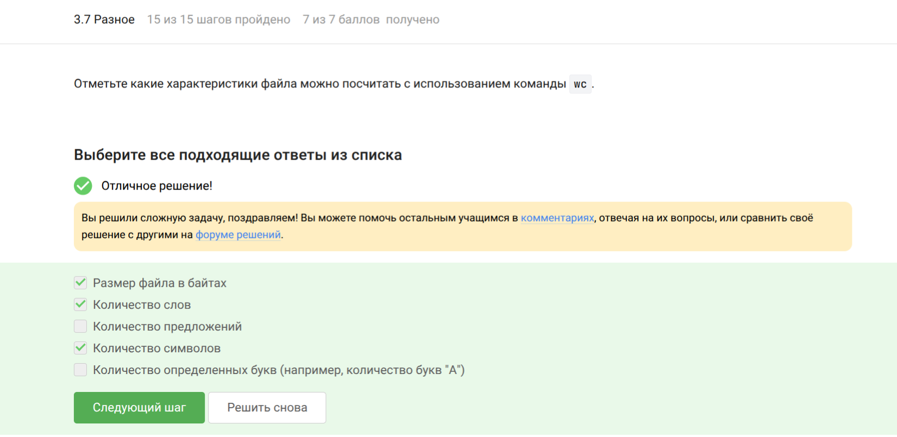{#fig:034 width=70%}

##

Самая короткая команда для создания трёх поддиректорий — `mkdir dir{1..3}`. Фигурные скобки в bash генерируют последовательность.

{#fig:035 width=70%}

# Выводы

Прошел модуль 3 курса Stepik «Введение в Linux».

# Список литературы

::: {#refs}
:::
