---
## Front matter
title: "Отчёт по модулю 3 курса ‘Stepik Введение в Linux’"
subtitle: "Дисциплина: Операционные системы"
author: "Мацюк Константин Владимирович"

## Generic otions
lang: ru-RU
toc-title: "Содержание"

## Bibliography
bibliography: bib/cite.bib
csl: pandoc/csl/gost-r-7-0-5-2008-numeric.csl

## Pdf output format
toc: true
toc-depth: 2
lof: true
lot: true
fontsize: 12pt
linestretch: 1.5
papersize: a4
documentclass: scrreprt
## I18n polyglossia
polyglossia-lang:
  name: russian
  options:
	- spelling=modern
	- babelshorthands=true
polyglossia-otherlangs:
  name: english
## I18n babel
babel-lang: russian
babel-otherlangs: english
## Fonts
mainfont: IBM Plex Serif
romanfont: IBM Plex Serif
sansfont: IBM Plex Sans
monofont: IBM Plex Mono
mathfont: STIX Two Math
mainfontoptions: Ligatures=Common,Ligatures=TeX,Scale=0.94
romanfontoptions: Ligatures=Common,Ligatures=TeX,Scale=0.94
sansfontoptions: Ligatures=Common,Ligatures=TeX,Scale=MatchLowercase,Scale=0.94
monofontoptions: Scale=MatchLowercase,Scale=0.94,FakeStretch=0.9
mathfontoptions:
## Biblatex
biblatex: true
biblio-style: "gost-numeric"
biblatexoptions:
  - parentracker=true
  - backend=biber
  - hyperref=auto
  - language=auto
  - autolang=other*
  - citestyle=gost-numeric
## Pandoc-crossref LaTeX customization
figureTitle: "Рис."
tableTitle: "Таблица"
listingTitle: "Листинг"
lofTitle: "Список иллюстраций"
lotTitle: "Список таблиц"
lolTitle: "Листинги"
## Misc options
indent: true
header-includes:
  - \usepackage{indentfirst}
  - \usepackage{float} # keep figures where there are in the text
  - \floatplacement{figure}{H} # keep figures where there are in the text
---

# Цель работы

Пройти курс «Введение в Linux»

# Задание

Выполнить модуль 3

# Выполнение 3 модуля

## Текстовый редактор vim

Для выхода из редактора vim сразу после открытия файла нужно нажать клавишу: , затем q и Enter, что переводит vim в командный режим и выполняет выход (рис. -@fig:001).

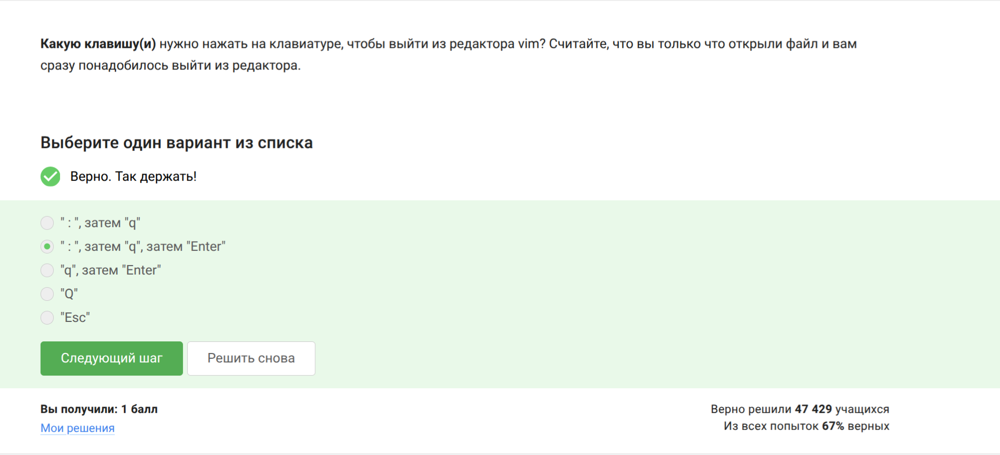{#fig:001 width=70%}

Различие между word и WORD: word состоит из букв, цифр и подчёркиваний, а WORD — из любых непробельных символов, поэтому нажатие w не может остановиться на точке, а для достижения конца строки требуется меньше нажатий W, чем w (рис. -@fig:002).

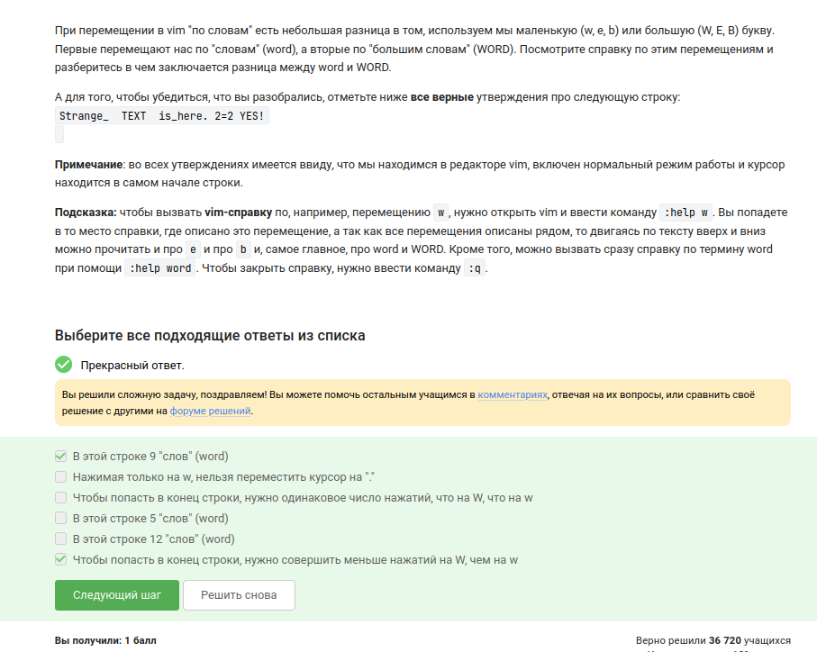{#fig:002 width=70%}

Для преобразования строки использованы команды: x2wwywPr — удаление слова «one», перемещение и вставка; d2wwywPr — аналогично с удалением двух слов; ddithree four four four five — удаление строки и вставка новой; d2wwifour four — удаление до «three» и вставка «four four» (рис. -@fig:003).

{#fig:003 width=70%}

Команда :%s/Windows/Linux/ выполняет глобальную замену первого вхождения (рис. -@fig:004).

{#fig:004 width=70%}

В режиме Visual (открывается из нормального режима клавишей v) доступны команды перемещения, а также команды d (удалить) и у (скопировать) (рис. -@fig:005).

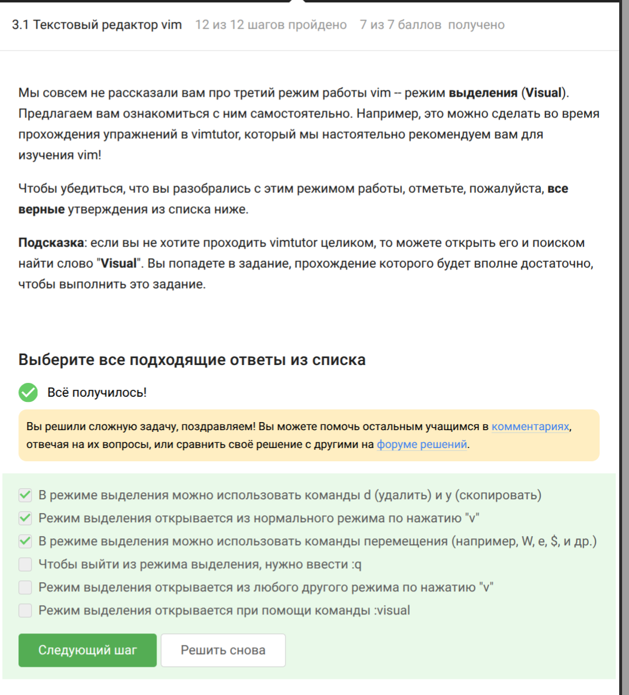{#fig:005 width=70%}

## Скрипты на bash: основы

Каждая оболочка bash имеет свою собственную историю команд, поэтому во вложенной оболочке будут доступны только команды, введённые непосредственно в ней (набор C) (рис. -@fig:006).

{#fig:006 width=70%}

Скрипт сначала переходит в /home/bi/, затем создаёт файл file1.txt в этой директории, поэтому абсолютный путь к созданному файлу – /home/bi/file1.txt (рис. -@fig:007).

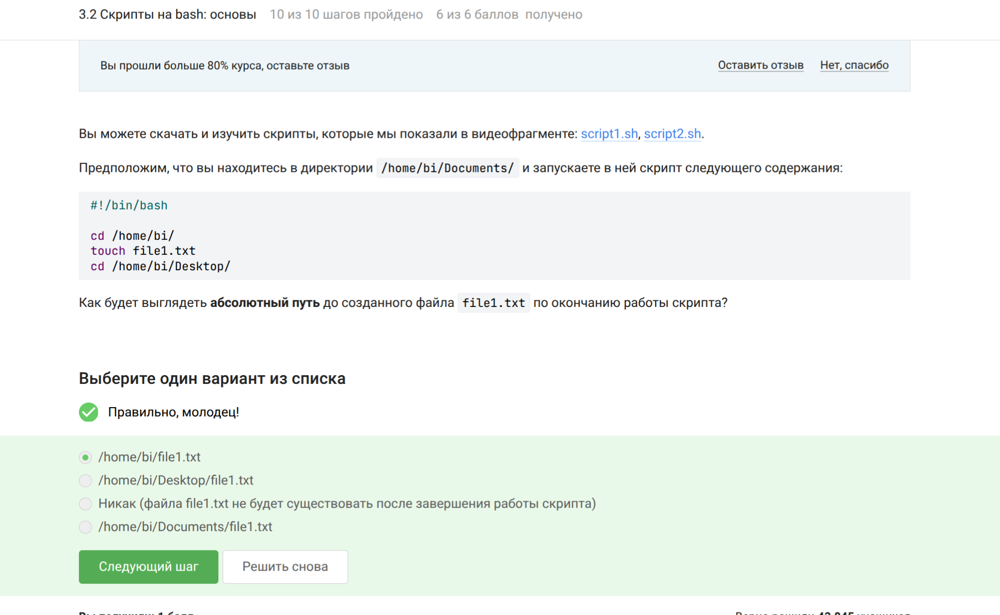{#fig:007 width=70%}

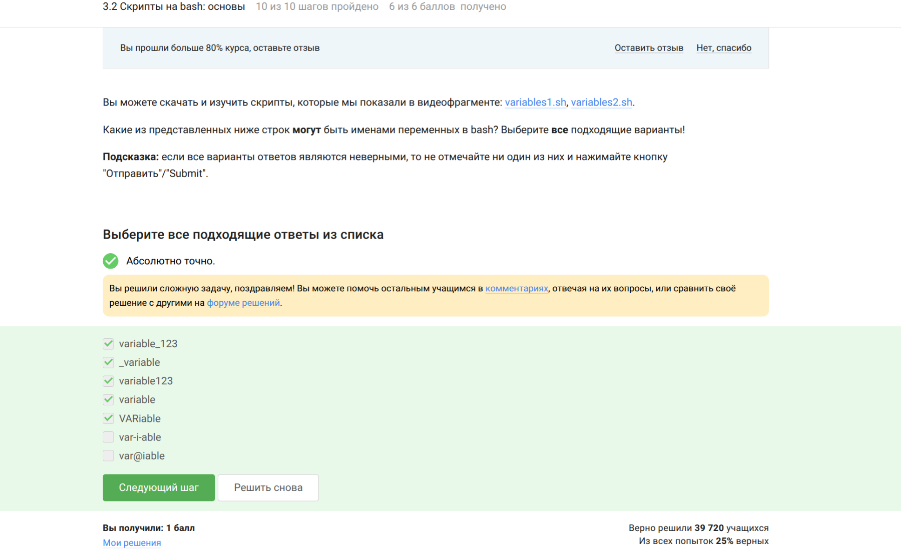{#fig:008 width=70%}

{#fig:009 width=70%}

Скрипт выводит строку с подстановкой первого и второго аргументов, при этом знак доллара перед $1 экранируется, чтобы напечатать литерал $1: echo «Arguments are: $1=$1 $2=$2». Например, при запуске ./script.sh one two на экране появится Arguments are: $1=one $2=two

## Скрипты на bash: ветвления и циклы

Условия 5 -ge 5 (5 больше или равно 5) и -z “ ” (пустая строка) всегда истинны независимо от параметров скрипта и значений переменных (рис. -@fig:010).

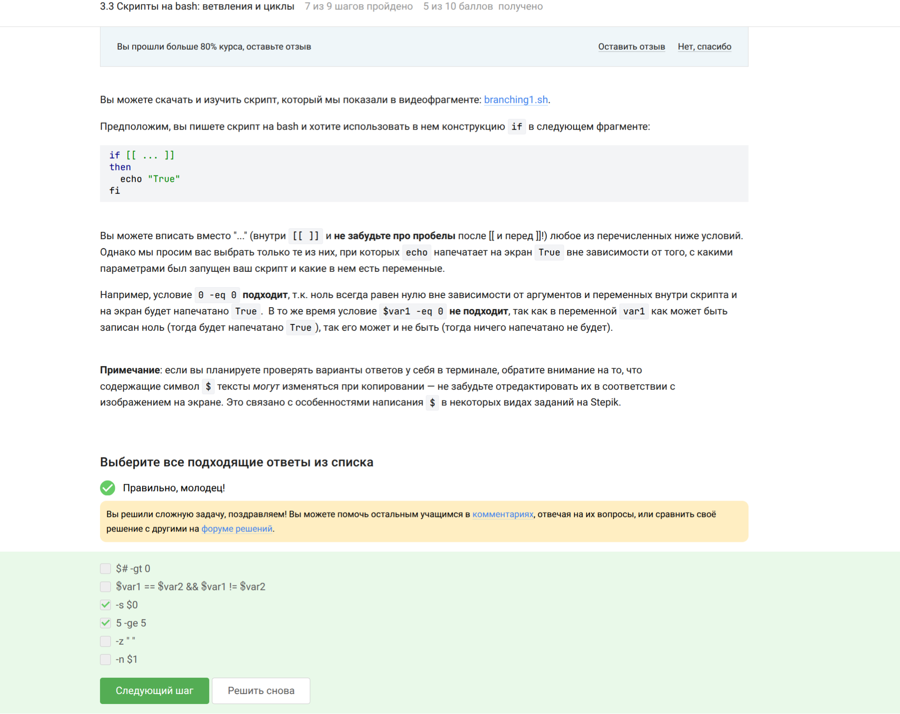{#fig:010 width=70%}

При var=3 ни одно из условий не выполняется (3 не больше 5, не меньше 3, не равно 4), поэтому выводится «four». При var=5 условие -gt проверяет строгое неравенство (5 > 5 ложно), затем -lt 3 ложно, -eq 4 ложно, снова срабатывает else и выводится «four». Таким образом, оба раза будет напечатано «four» (рис. -@fig:011).

{#fig:011 width=70%}

Скрипт анализирует первый аргумент $1: если 0 – «No students», если 1 – «1 student», если от 2 до 4 – «$1 students», иначе «A lot of students». В коде важно использовать условие -lt 5 для диапазона 2-4, потому что -lt означает «меньше» (рис. -@fig:012).

{#fig:012 width=70%}

Цикл for перебирает три элемента: «a,», «b,» и «c_d» (запятые входят в состав строк). Команда continue пропускает вывод «finish» для тех строк, которые лексикографически больше «c». Строка «c_d» больше «c», поэтому «finish» не выводится. Остальные две строки выводят и «start», и «finish». Итого «start» появится 5 раз, а «finish» — 4 раза (рис. -@fig:013).

{#fig:013 width=70%}

Скрипт в бесконечном цикле читает имя и возраст. Если имя пустое или возраст равен 0, выводится «bye» и цикл прерывается. Иначе проверяется возраст: если <=16 — группа «child», если <=25 — «youth», иначе «adult». После вывода сообщения цикл повторяется (рис. -@fig:014).

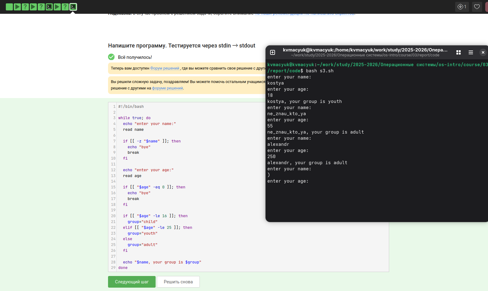{#fig:014 width=70%}

## Скрипты на bash: разное

Команда let выполняет арифметические операции (рис. -@fig:015).

{#fig:015 width=70%}

Обратные кавычки выполняют команду pwd, которая выводит текущий рабочий каталог. После cd /home/bi/ текущим становится /home/bi, поэтому echo выводит /home/bi (рис. -@fig:016).

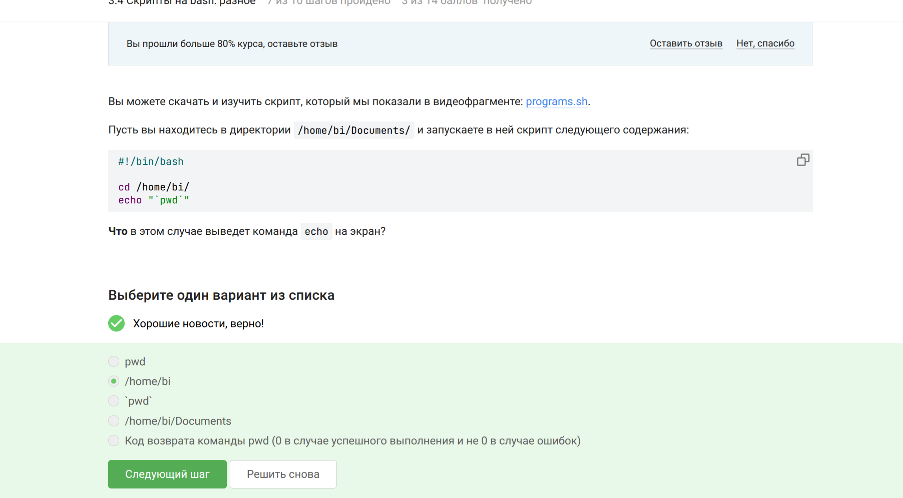{#fig:016 width=70%}

Чтобы проверить код возврата программы, её нужно запустить отдельно, а затем проверить переменную $? (например, if [[ $? -eq 0 ]]). Нельзя использовать if program, потому что подстановка команды подставляет её вывод, а не код возврата (рис. -@fig:017).

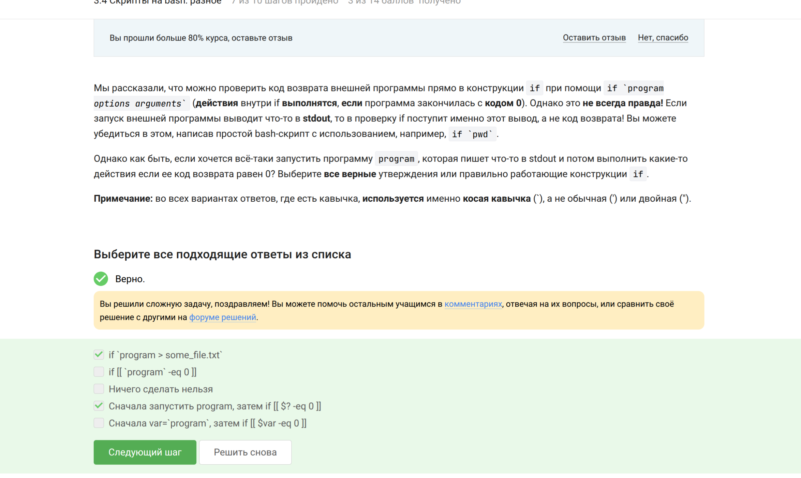{#fig:017 width=70%}

В функции counter переменная c1 объявлена как local, поэтому её значение не сохраняется между вызовами — после десяти вызовов c1 остаётся пустой. Переменная c2 не локальная, она накапливает сумму: 2*(1+2+...+10)=110. Команда echo выводит «counters are and 110» (между are и and два пробела) (рис. -@fig:018).

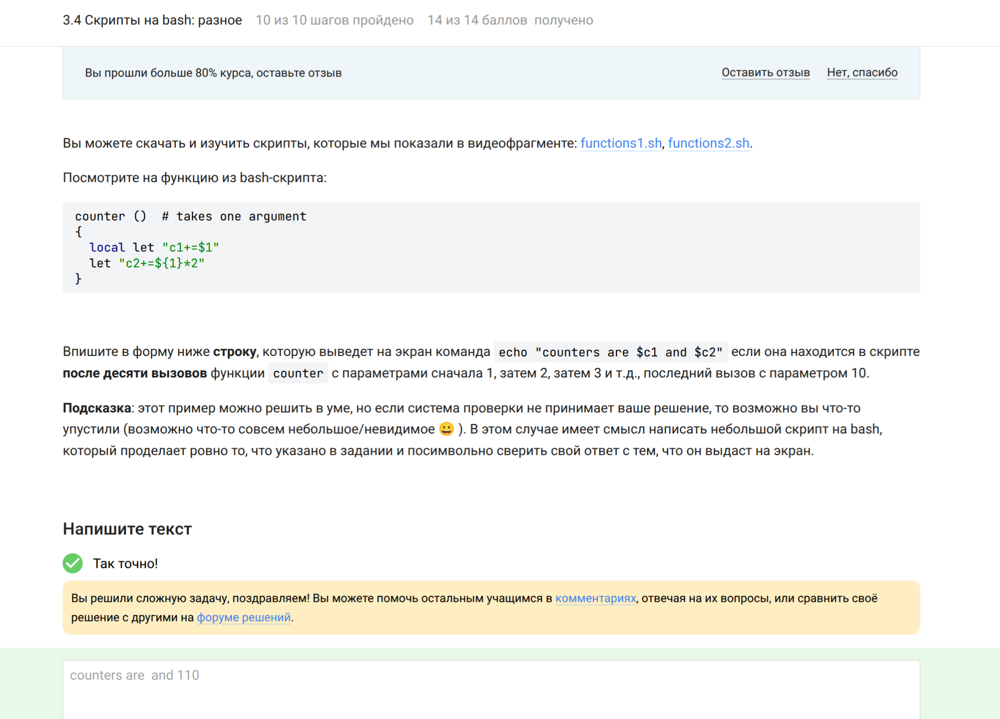{#fig:018 width=70%}

Функция gcd реализует алгоритм Евклида через вычитание в цикле while. Пока M не равно N, из большего вычитается меньшее. После цикла выводится «GCD is ». Основная программа читает пары чисел через read -r numbers, затем с помощью set – $numbers разбивает строку на аргументы и вызывает gcd. При пустой строке выводится «bye» и выполнение прекращается (рис. -@fig:019).

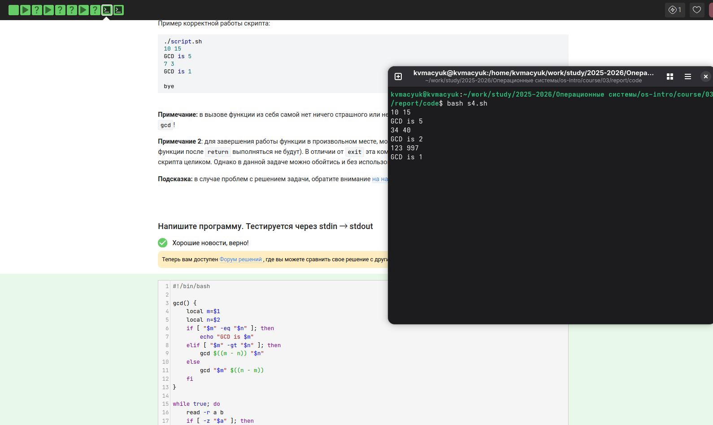{#fig:019 width=70%}

Программа читает строки в цикле. Если введено «exit», выводится «bye» и цикл прерывается. Иначе пытается вычислить выражение через let r=((exp)). Если вычисление успешно, выводится результат, иначе выводится «ergor» и скрипт завершается (рис. -@fig:020).

{#fig:020 width=70%}

## Продвинутый поиск и редактирование

Опция -iname игнорирует регистр, поэтому найдутся все файлы, начинающиеся с «star» в любом регистре. Опция -name учитывает регистр. Команда find -iname «star*» найдёт все четыре файла, начинающихся на Star/STAR/star. Разница — все четыре. В списке ответов отмечены STARS.txt и Star_Wars.avi (рис. -@fig:021).

{#fig:021 width=70%}

Опции -path и -name отличаются: -path сопоставляет весь путь, а -name только имя файла. Их замена иногда даёт одинаковый результат, например, когда файл находится в корне поиска. Утверждение «Если заменить -name на -path, результат поиска иногда может остаться таким же» верно (рис. -@fig:022).

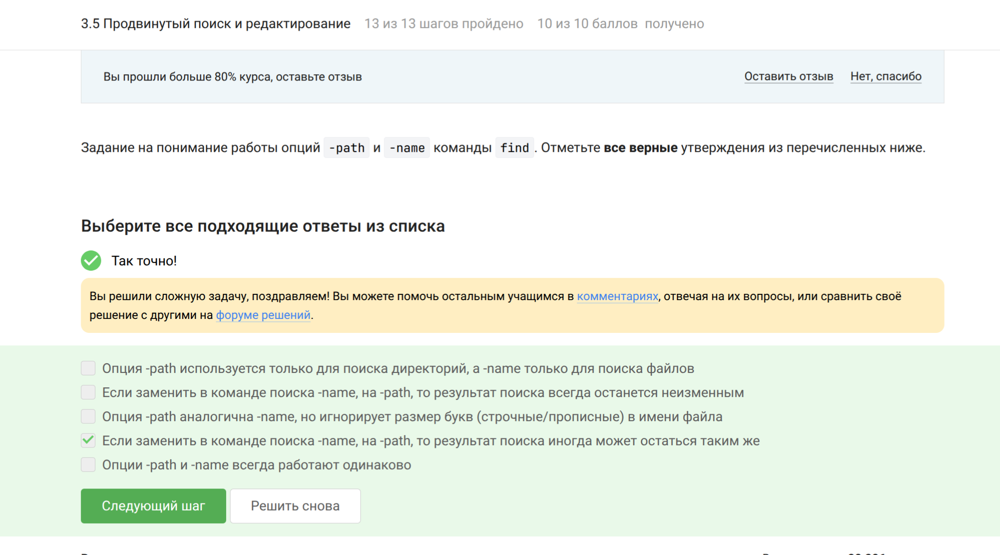{#fig:022 width=70%}

Во всех вариантах grep выводит одинаковое количество строк, потому что каждая строка файла содержит слово «word». Опции -A, -B, -C добавляют контекст, но так как в каждой строке есть искомое слово, то добавленные строки контекста — это те же самые строки, которые уже выводятся. В итоге все команды создадут файл results.txt одинакового размера (рис. -@fig:023).

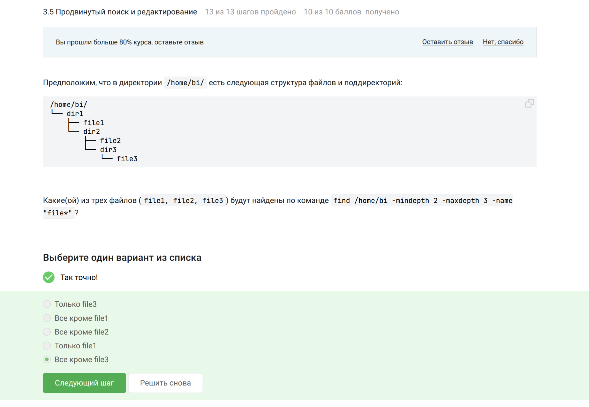{#fig:023 width=70%}

Регулярное выражение ищет строки, заканчивающиеся определённым образом (рис. -@fig:024).

{#fig:024 width=70%}

Без опции -n sed печатает каждую строку по умолчанию, а команда p печатает строку ещё раз. Строки, соответствующие шаблону [a-z]* (любая строка, содержащая хотя бы одну строчную букву), будут выведены дважды. Если строка не соответствует шаблону, она будет напечатана один раз (рис. -@fig:025).

{#fig:025 width=70%}

Инструкция sed „s/ [A-Z][A-Z]+ / abbreviation /g“ input.txt > edited.txt заменяет последовательности из двух и более заглавных букв, окружённые пробелами, на слово abbreviation. Пробелы до и после сохраняются (рис. -@fig:026).

{#fig:026 width=70%}

## Строим графики в gnuplot

Опция -p (–persist) при запуске gnuplot предотвращает закрытие окон с графиками после завершения работы программы (рис. -@fig:027).

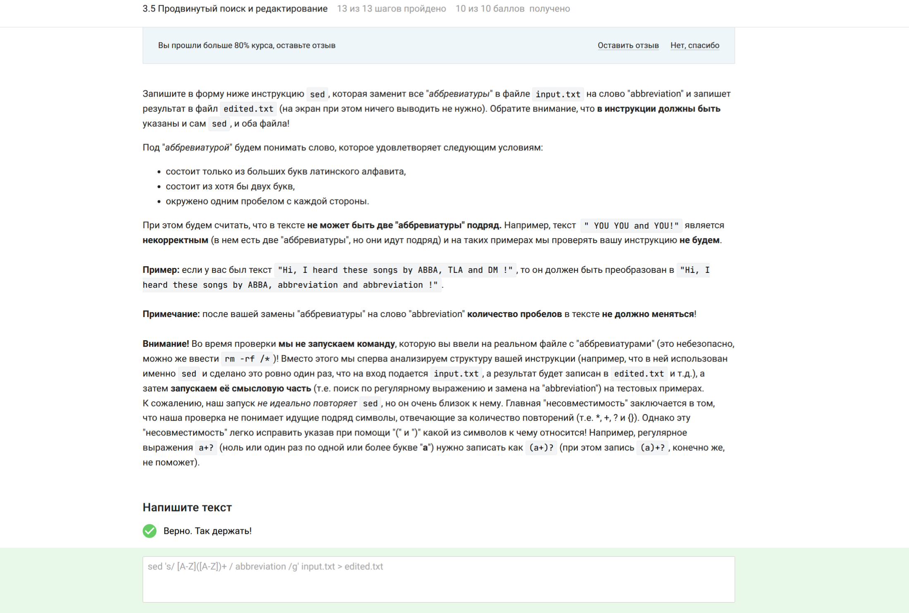{#fig:027 width=70%}

При использовании set key autotitle columnhead и отсутствии заголовков в первой строке, gnuplot воспринимает первую строку как данные, а не как заголовок. Поэтому название ряда берётся из первого значения второго столбца (первая строка, второе поле). Всего точек будет нарисовано 9, потому что первая строка использована для названия и не отображается как точка (рис. -@fig:028).

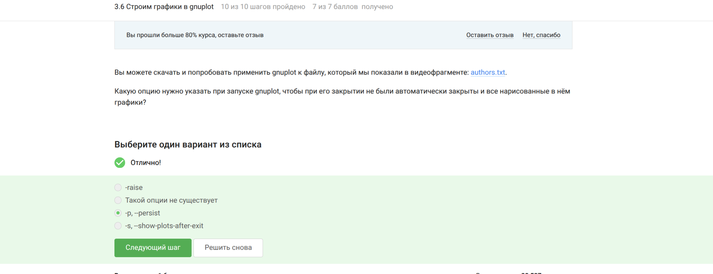{#fig:028 width=70%}

Команда set xtics создаёт пользовательские деления на оси X. Конкатенация строк: set xtics ('point 1, value '.x1 x1, 'point 2, value '.x2 x2, 'point 3, value '.x3 x3) (рис. -@fig:029).

{#fig:029 width=70%}

Для отражения графика относительно горизонтальной плоскости функция изменена на -x2-y2 (вместо x2+y2). Обратное вращение достигается изменением приращения угла: zrot=(zrot+350)%360 (350 эквивалентно -10). Ускорение в два раза — уменьшением паузы с 0.2 до 0.1 секунды (рис. -@fig:030).

{#fig:030 width=70%}

## Разное

Права rwxr-xr– соответствуют числовому значению 764. Правильные команды: chmod a+wx file.txt; chmod o-wx file.txt; chmod g-x file.txt; chmod ug+w file.txt; chmod u+x file.txt; chmod 764 file.txt; chmod u+wx file.txt; chmod g+w file.txt (рис. -@fig:031).

{#fig:031 width=70%}

Чтобы пользователь user из группы group мог создавать файлы в директории, нужно либо сменить владельца (sudo chown user dir или sudo chown user:group dir), либо добавить право записи для группы или всех с sudo: sudo chmod o+w dir или sudo chmod a+w dir. Просто chmod o+w без sudo не сработает, так как директория принадлежит root (рис. -@fig:032).

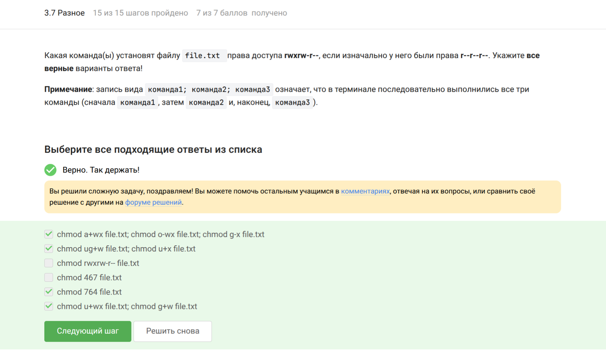{#fig:032 width=70%}

Команда wc (word count) может подсчитать количество байт (опция -c), количество слов (-w) и количество символов (-m). Она не умеет считать предложения или отдельные буквы (рис. -@fig:033).

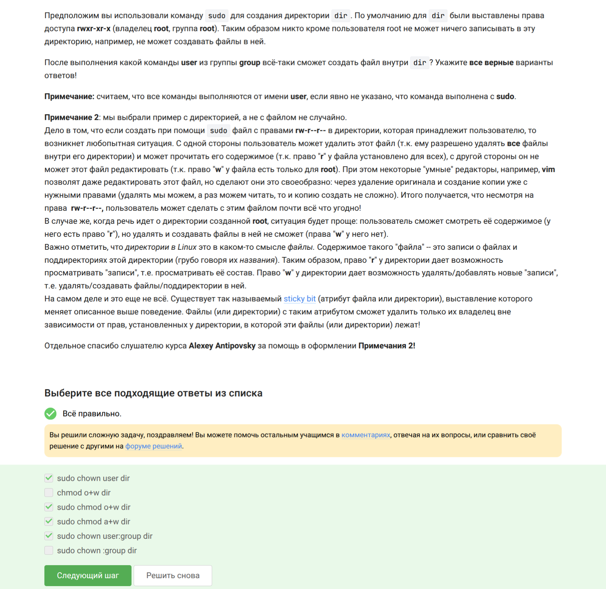{#fig:033 width=70%}

Команда du -sh (или du -h -s) выводит суммарный размер текущей директории (рис. -@fig:034).

{#fig:034 width=70%}

Самая короткая команда для создания трёх поддиректорий — mkdir dir{1..3}. Фигурные скобки в bash генерируют последовательность: dir1, dir2, dir3 (рис. -@fig:035).

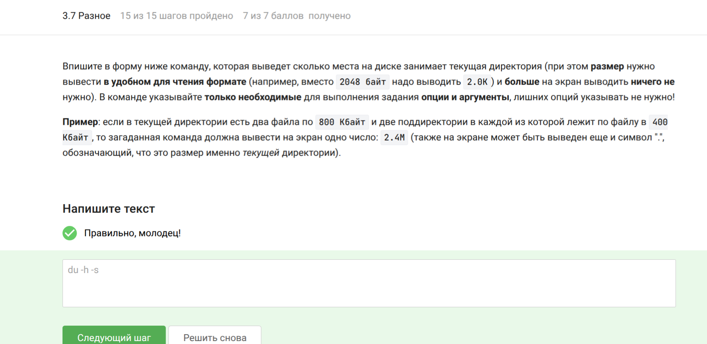{#fig:035 width=70%}

# Выводы

Я прошел модуль 3 курса Stepik

# Список литературы{.unnumbered}

::: {#refs}
:::
