---
## Front matter
title: "Лабораторная работа №1. Установка ОС Linux"
subtitle: "Дисциплина: Архитектура компьютеров и операционные системы"
author: "Мацюк Константин Владимирович"

## Generic otions
lang: ru-RU
toc-title: "Содержание"

## Bibliography
bibliography: bib/cite.bib
csl: pandoc/csl/gost-r-7-0-5-2008-numeric.csl

## Pdf output format
toc: true
toc-depth: 2
lof: true
lot: true
fontsize: 12pt
linestretch: 1.5
papersize: a4
documentclass: scrreprt
## I18n polyglossia
polyglossia-lang:
  name: russian
  options:
	- spelling=modern
	- babelshorthands=true
polyglossia-otherlangs:
  name: english
## I18n babel
babel-lang: russian
babel-otherlangs: english
## Fonts
mainfont: IBM Plex Serif
romanfont: IBM Plex Serif
sansfont: IBM Plex Sans
monofont: IBM Plex Mono
mathfont: STIX Two Math
mainfontoptions: Ligatures=Common,Ligatures=TeX,Scale=0.94
romanfontoptions: Ligatures=Common,Ligatures=TeX,Scale=0.94
sansfontoptions: Ligatures=Common,Ligatures=TeX,Scale=MatchLowercase,Scale=0.94
monofontoptions: Scale=MatchLowercase,Scale=0.94,FakeStretch=0.9
mathfontoptions:
## Biblatex
biblatex: true
biblio-style: "gost-numeric"
biblatexoptions:
  - parentracker=true
  - backend=biber
  - hyperref=auto
  - language=auto
  - autolang=other*
  - citestyle=gost-numeric
## Pandoc-crossref LaTeX customization
figureTitle: "Рис."
tableTitle: "Таблица"
listingTitle: "Листинг"
lofTitle: "Список иллюстраций"
lotTitle: "Список таблиц"
lolTitle: "Листинги"
## Misc options
indent: true
header-includes:
  - \usepackage{indentfirst}
  - \usepackage{float} # keep figures where there are in the text
  - \floatplacement{figure}{H} # keep figures where there are in the text
---

# Цель работы

Целью данной работы является приобретение практических навыков установки операционной системы на виртуальную машину, настройки минимально необходимых для дальнейшей работы сервисов.

# Задание

- Создание виртуальной машины в VirtualBox
- Установка операционной системы Linux (Fedora Workstation)
- Первоначальная настройка ОС
- Установка необходимого ПО для дальнейшей работы

# Выполнение лабораторной работы

## Создание виртуальной машины

Создал виртуальную машину VirtualBox, используя скачанный образ iso (увы, sway-версию установить не удалось). (рис. -@fig:001)

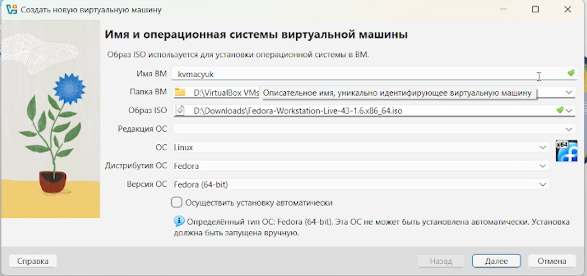{#fig:001 width=70%}

Задал объём оперативной памяти — 8555 МБ и количество процессоров - 8. Создал виртуальный жёсткий диск размером 35.22 ГБ (рис. -@fig:002)

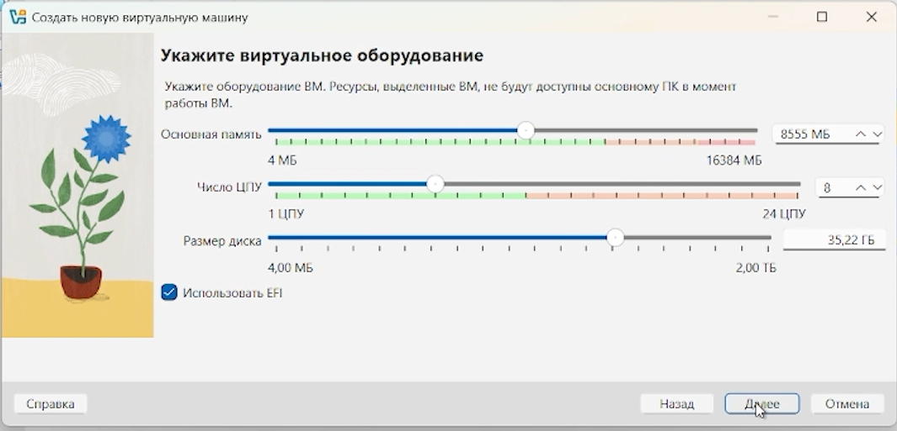{#fig:002 width=70%}

## Установка операционной системы

Запустил виртуальную машину. После загрузки LiveCD появляется рабочий стол с предложением установить систему на диск. Нажимаю "Install Fedora Linux...". (рис. -@fig:003)

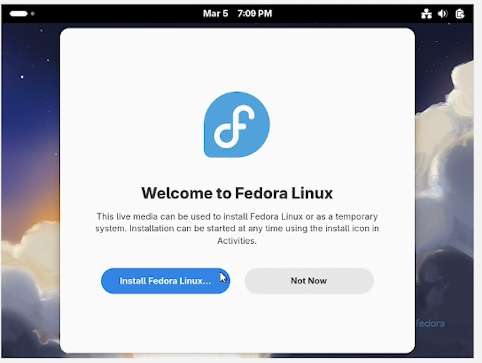{#fig:003 width=70%}

Выбираю русский язык интерфейса установщика. (рис. -@fig:004)

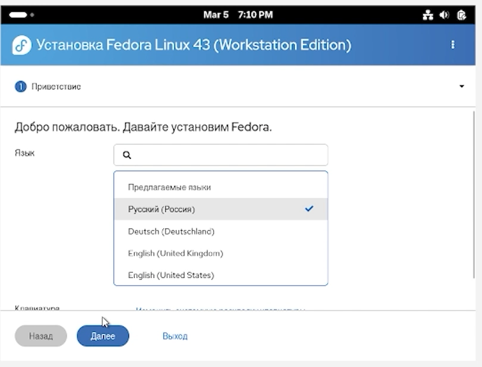{#fig:004 width=70%}

Перед установкой системы диск форматируется. (рис. -@fig:005)

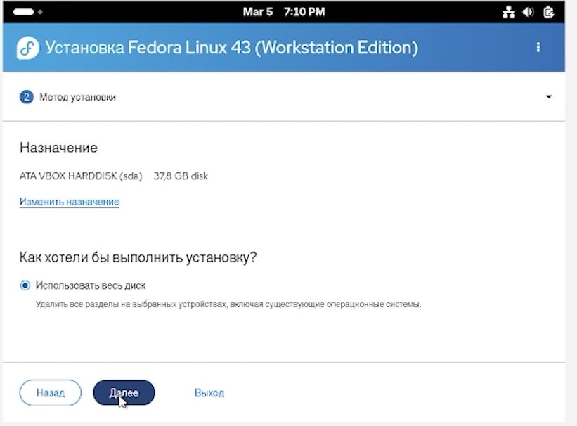{#fig:005 width=70%}

Опция шифрования необязательна. (рис. -@fig:006)

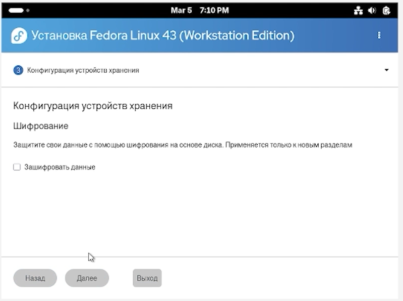{#fig:006 width=70%}

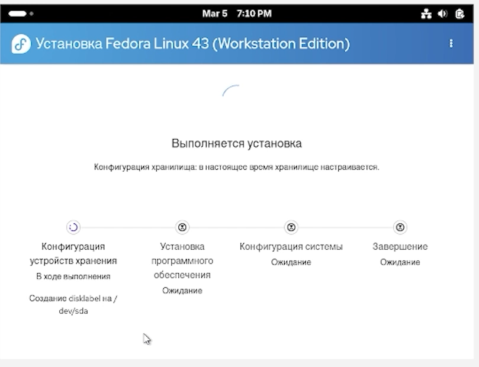{#fig:007 width=70%}

Затем, после перезапуска системы, снова выбираю раскладку клавиатуры. (рис. -@fig:009)

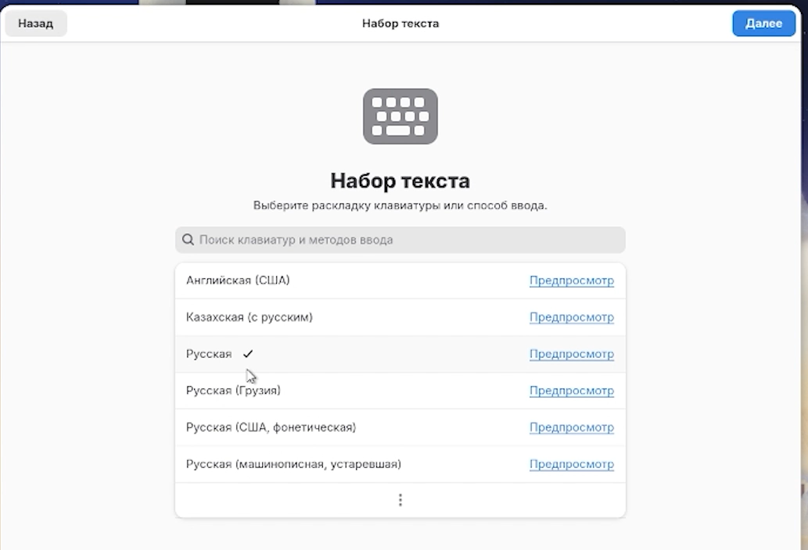{#fig:008 width=70%}

Создаю пользователя: в поле имя пользователя указываю свой логин из дисплейного класса, задаю пароль. Также задаю пароль root и устанавливаю имя хоста равное моему логину. (рис. -@fig:009)

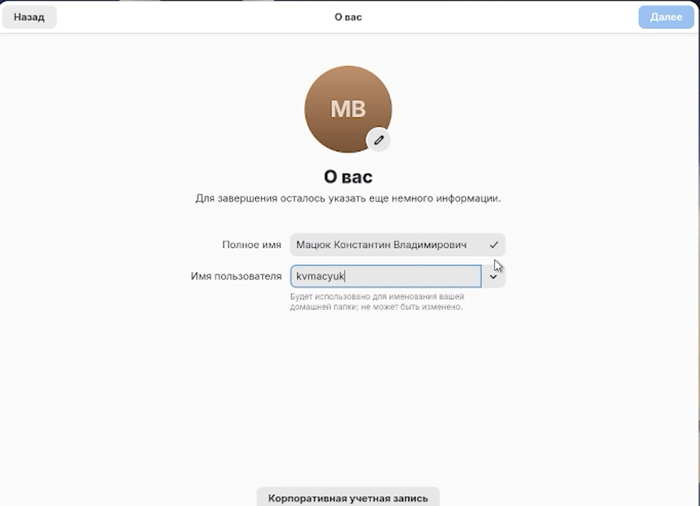{#fig:009 width=70%}

После завершения перезапускаю систему. В настройках VirtualBox вручную пришлось отключить ISO-образ от системы.

## Настройка системы после установки

Устанавливаю development-tools и dkms с помощью dnf (рис. -@fig:010, рис. -@fig:011)

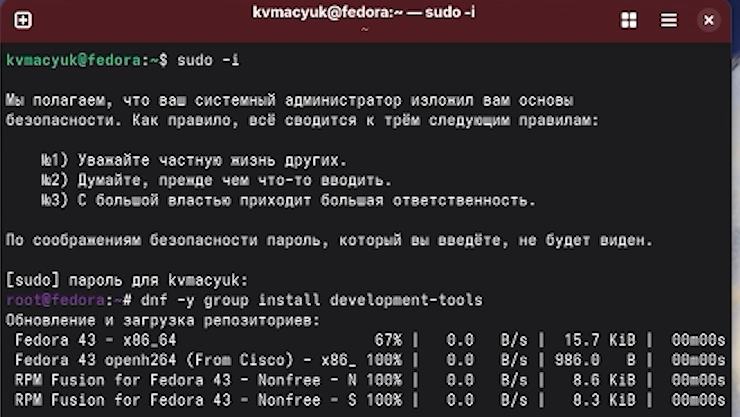{#fig:010 width=70%}

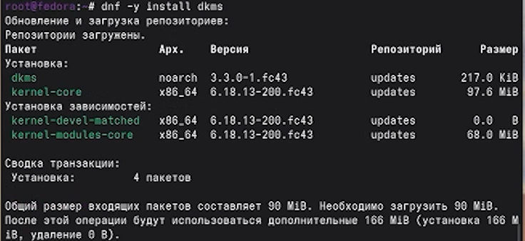{#fig:011 width=70%}

Обновляю репозитории и устанавливаю tmux.

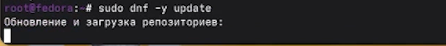{#fig:012 width=70%}

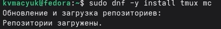{#fig:013 width=70%}

## Отключение SELinux

Открываю конфигурационный файл SELinux и меняю значение `SELINUX=enforcing` на `SELINUX=permissive`:

Сохраняю файл и перезагружаю систему. (рис. -@fig:014)

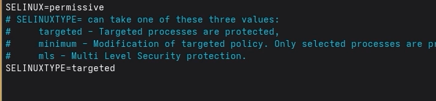{#fig:014 width=70%}

## Настройка раскладки клавиатуры

Это уже было сделано при установке через Gnome.

## Имя хоста

Меняю имя хоста и перепроверяю его командой 'hostnamectl'. (рис. -@fig:015)

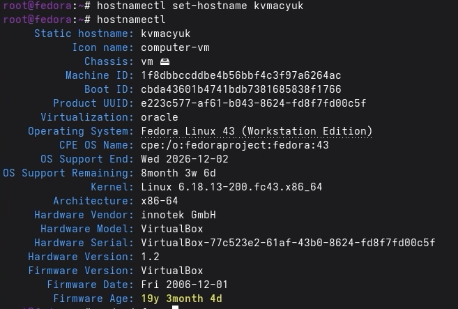{#fig:015 width=70%}

## Установка ПО для создания документации

Устанавливаю pandoc, pandoc-crossref и texlive для работы с отчетами Markdown:

Для pandoc-crossref скачиваю бинарный файл с GitHub и помещаю в `/usr/local/bin/`.

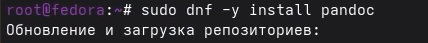{#fig:016 width=70%}

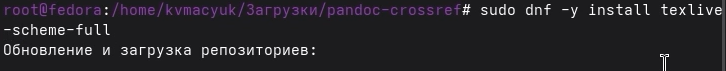{#fig:017 width=70%}

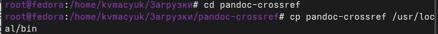{#fig:018 width=70%}

# Домашнее задание

Анализирую последовательность загрузки системы с помощью команды `dmesg` и фильтрации через `grep`:

Версия ядра Linux:

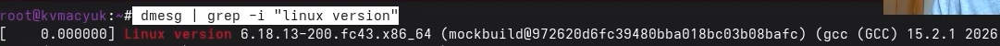{#fig:019 width=70%}

Частота процессора:

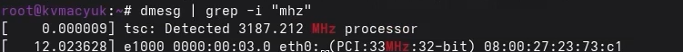{#fig:020 width=70%}

Модель процессора:

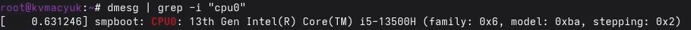{#fig:021 width=70%}

Объём доступной оперативной памяти:

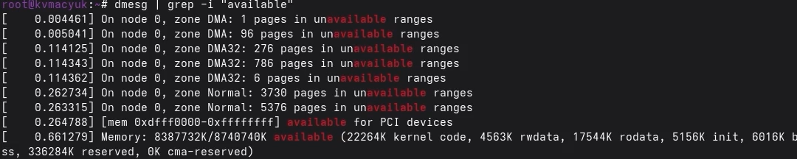{#fig:022 width=70%}

Тип обнаруженного гипервизора:

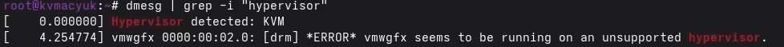{#fig:023 width=70%}

Тип файловой системы корневого раздела:

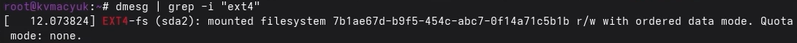{#fig:024 width=70%}

Последовательность монтирования файловых систем:

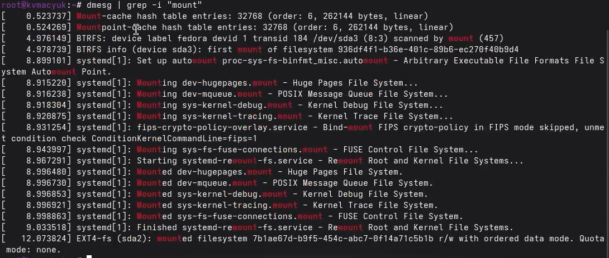{#fig:025 width=70%}

# Ответы на контрольные вопросы

**1. Какие данные хранятся в учётной записи пользователя?**

В учётной записи содержатся: логин, зашифрованный пароль, UID (идентификатор пользователя), GID (идентификатор группы), путь к домашней директории и командная оболочка, используемая по умолчанию. Вся эта информация находится в файлах `/etc/passwd` и `/etc/shadow`.

**2. Полезные команды терминала и их использование:**

- Получение справочной информации: `man ls`
- Навигация по файловой системе: `cd /home/user`
- Просмотр содержимого каталога: `ls -la`
- Оценка занимаемого места: `du -sh /home`
- Создание нового каталога: `mkdir mydir`
- Удаление каталога вместе с содержимым: `rm -r mydir`
- Создание пустого файла: `touch file.txt`
- Удаление файла: `rm file.txt`
- Изменение прав доступа: `chmod 755 file.sh`
- Просмотр ранее введённых команд: `history`

**3. Что понимается под файловой системой? Приведите примеры.**

Файловая система определяет способ организации, хранения и именования данных на диске. Наиболее распространённые:

- **ext4** — стандартная журналируемая ФС в Linux, надёжная и производительная.
- **xfs** — ориентирована на высокую скорость работы с большими файлами.
- **btrfs** — поддерживает снапшоты, сжатие и другие современные возможности.
- **FAT32** — простая и совместимая с разными ОС, но имеет ограничение на размер файла (4 ГБ).
- **NTFS** — основная ФС Windows, поддерживает большие тома и права доступа.

**4. Как проверить, какие файловые системы смонтированы в данный момент?**

Можно использовать одну из команд: `mount`, `df -h` или просмотреть файл `cat /proc/mounts`.

**5. Как принудительно завершить процесс, который перестал отвечать?**

Сначала нужно определить идентификатор процесса (PID) с помощью команды `ps aux | grep имя_процесса`.
Затем можно отправить сигнал завершения: `kill PID`.
Если процесс не завершается, используется принудительный вариант: `kill -9 PID`.
Также можно завершить все процессы с определённым именем: `killall имя_процесса`.

# Выводы

Были приобретены практические навыки установки операционной системы на виртуальную машину, настройки минимально необходимых для дальнейшей работы сервисов.

# Список литературы{.unnumbered}

::: {#refs}
:::
