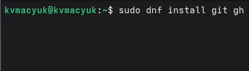
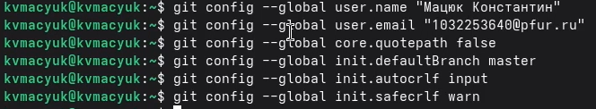
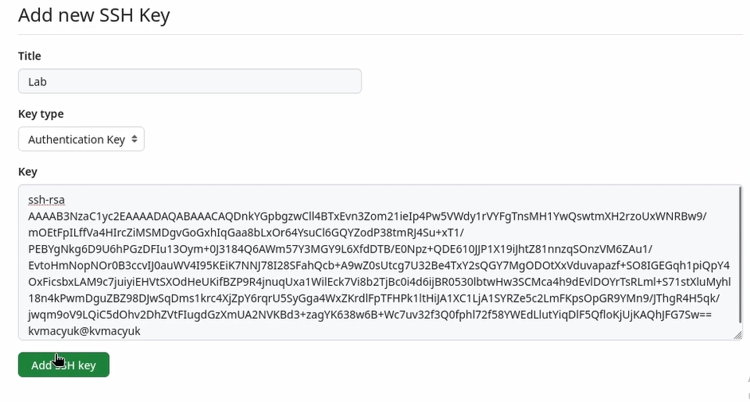
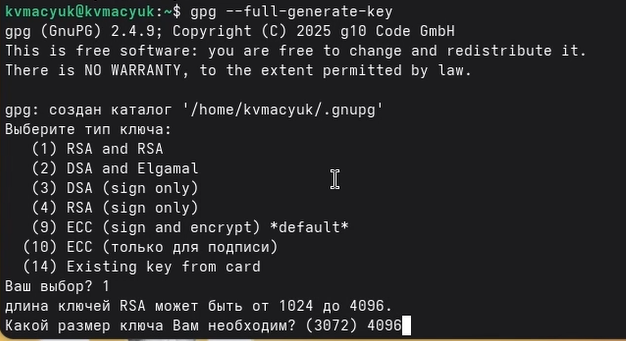
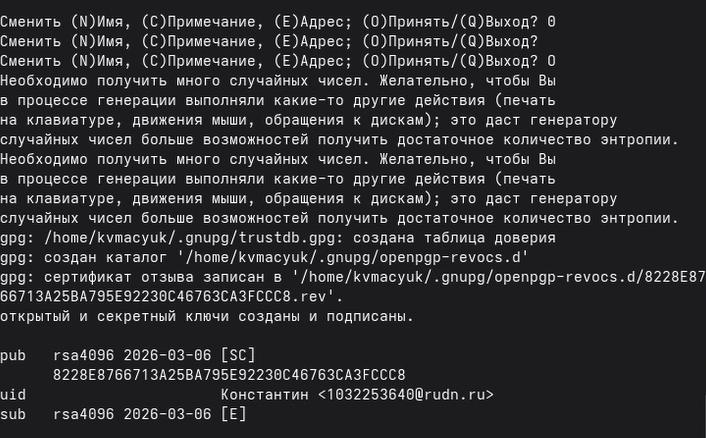
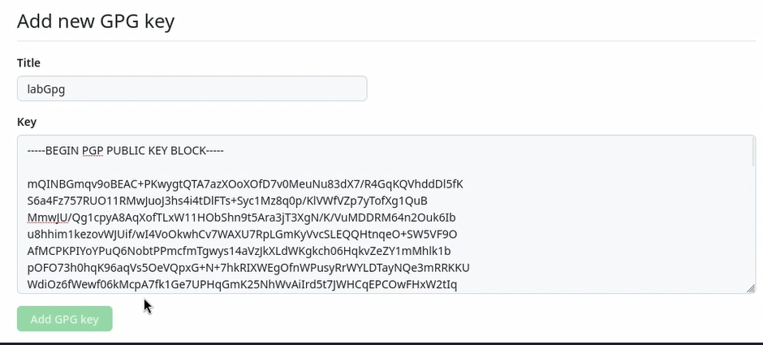
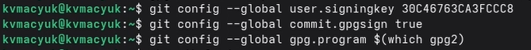
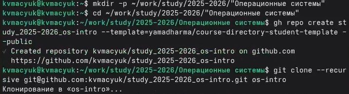
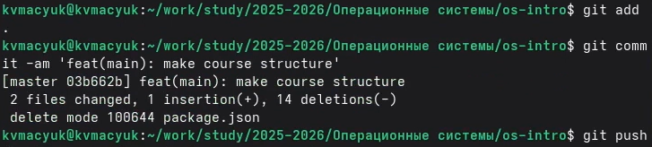

---
## Front matter
title: "Лабораторная работа №2"
subtitle: "Первоначальная настройка git"
author: "Мацюк Константин Владимирович"
institute: "Российский университет дружбы народов"
date: "2026"

## Generic options
lang: ru-RU

## Beamer options
theme: "default"
colortheme: "default"
fonttheme: "default"
mainfont: "IBM Plex Serif"
sansfont: "IBM Plex Sans"
monofont: "IBM Plex Mono"
fontsize: 10pt
aspectratio: 169
section-titles: true
toc: true
toc-depth: 2
header-includes:
  - \usepackage{float}
  - \usepackage{indentfirst}
---

# Цель работы

Изучить идеологию и применение средств контроля версий.
Освоить умения по работе с git.

# Задание

- Создать базовую конфигурацию для работы с git
- Создать ключ SSH
- Создать ключ PGP
- Настроить подписи git
- Зарегистрироваться на Github
- Создать локальный каталог для выполнения заданий по предмету

# Выполнение лабораторной работы

## Установка ПО

Установка git и gh с помощью dnf

{#fig:001 width=70%}

## Базовая настройка git

- Задание имени и email владельца репозитория
- Настройка utf-8 в выводе сообщений
- Задание имени начальной ветки master
- Настройка параметров autocrlf и safecrlf

{#fig:002 width=70%}

## Создание SSH ключа

Генерация SSH ключа по алгоритму RSA (4096 бит)

{#fig:003 width=70%}

## Добавление SSH ключа на GitHub

Добавление ключа с названием Lab в настройках GitHub

{#fig:004 width=70%}

## Создание PGP ключа

Генерация PGP ключа:
- Тип: RSA and RSA
- Размер: 4096 бит
- Срок действия: 0 (бессрочно)

{#fig:005 width=70%}

## Просмотр PGP ключей

Просмотр списка ключей и копирование fingerprint

{#fig:006 width=70%}

## Экспорт PGP ключа

Экспорт ключа для добавления на GitHub

{#fig:007 width=70%}

## Добавление PGP ключа на GitHub

Добавление GPG ключа в настройках GitHub

{#fig:008 width=70%}

## Настройка подписей коммитов

Настройка автоматической подписи коммитов с использованием PGP ключа

{#fig:009 width=70%}

## Настройка GitHub CLI

Авторизация в GitHub CLI

{#fig:010 width=70%}

## Создание репозитория курса

Создание каталога и клонирование шаблона

{#fig:011 width=70%}

## Настройка репозитория

- Удаление лишних файлов
- Создание файла COURSE
- Запуск make

{#fig:012 width=70%}

## Настройка репозитория

{#fig:013 width=70%}

# Контрольные вопросы

## 1. Что такое VCS?

**VCS** (Version Control System) — программное обеспечение для регистрации изменений в файлах проекта.

Возможности:
- Сохранение состояний файлов
- Восстановление ранних версий
- Организация совместной работы
- Минимизация конфликтов

## 2. Основные понятия

| Термин | Определение |
|--------|-------------|
| **Репозиторий** | Хранилище в папке `.git` со всеми версиями файлов и историей |
| **Коммит** | Зафиксированный снимок состояния файлов с описанием изменений |
| **История** | Цепочка коммитов, показывающая эволюцию проекта |
| **Рабочая копия** | Текущее содержимое файлов проекта на диске |

## 3. Типы VCS

**Централизованные:**
- Единый сервер с полной историей
- Рабочие копии у разработчиков
- Примеры: CVS, Subversion (SVN)

**Распределённые:**
- Полная копия репозитория у каждого
- Примеры: Git, Mercurial

## 4. Единоличная работа с хранилищем

- Инициализация локального хранилища
- Добавление файлов под контроль версий
- Фиксация изменений с описанием
- Просмотр истории изменений
- Возврат к предыдущим версиям при необходимости

## 5. Работа с общим хранилищем

- Получение актуальной версии проекта из общего хранилища
- Внесение изменений в локальной рабочей копии
- Фиксация изменений в локальном репозитории
- Отправка зафиксированных изменений в общее хранилище
- Разрешение конфликтов при одновременном изменении одних файлов


## 6. Основные функции Git

- Контроль изменений в файлах
- Ведение истории версий
- Создание и управление ветками
- Объединение изменений
- Откат к предыдущим версиям

## 7. Команды Git

Основные команды Git:

| Команда | Описание |
|---------|----------|
| `git init` | Создание нового репозитория |
| `git clone` | Клонирование удалённого репозитория |
| `git add` | Добавление файлов в индекс |
| `git commit` | Фиксация изменений |
| `git push` | Отправка изменений на сервер |
| `git pull` | Получение изменений с сервера |
| `git status` | Просмотр состояния рабочей копии |
| `git log` | Просмотр истории коммитов |
| `git branch` | Управление ветками |
| `git merge` | Слияние веток |

## 8. Примеры работы

**Локальный репозиторий:**
```bash
git init
echo "hello" > file.txt
git add file.txt
git commit -m "начальный коммит"
```

**Удалённый репозиторий:**
```bash
git remote add origin git@github.com:user/repo.git
git push -u origin main
git pull
```

## 9. Назначение веток

- Изолированная разработка новых возможностей
- Исправление ошибок отдельно от основного кода
- Слияние завершённых изменений с основной веткой
- Предотвращение попадания неготового кода в продакшен

## 10. Игнорирование файлов

Файл **`.gitignore`** в корне репозитория:

```
*.log
*.tmp
node_modules/
build/
```

Назначение:
- Исключение временных файлов
- Исключение артефактов сборки
- Защита конфиденциальных данных

# Выводы

В ходе выполнения лабораторной работы:

- Изучена идеология и применение средств контроля версий
- Выполнена базовая настройка git
- Созданы SSH и PGP ключи
- Настроены подписи коммитов
- Освоена работа с GitHub CLI (gh)
- Создан репозиторий курса на основе шаблона

# Список литературы

