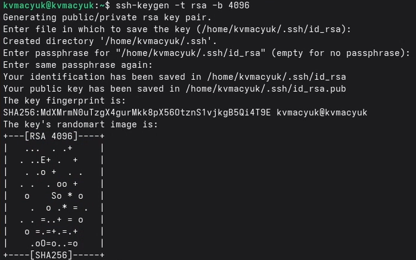
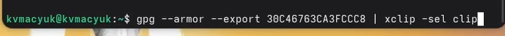
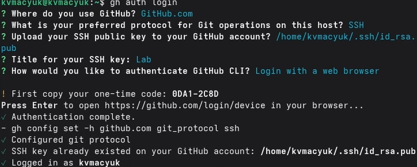
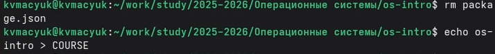

---
## Front matter
title: "Лабораторная работа №2. Первоначальная настройка git"
subtitle: "Дисциплина: Архитектура компьютеров и операционные системы"
author: "Мацюк Константин Владимирович"

## Generic otions
lang: ru-RU
toc-title: "Содержание"

## Bibliography
bibliography: bib/cite.bib
csl: pandoc/csl/gost-r-7-0-5-2008-numeric.csl

## Pdf output format
toc: true
toc-depth: 2
lof: true
lot: true
fontsize: 12pt
linestretch: 1.5
papersize: a4
documentclass: scrreprt
## I18n polyglossia
polyglossia-lang:
  name: russian
  options:
	- spelling=modern
	- babelshorthands=true
polyglossia-otherlangs:
  name: english
## I18n babel
babel-lang: russian
babel-otherlangs: english
## Fonts
mainfont: IBM Plex Serif
romanfont: IBM Plex Serif
sansfont: IBM Plex Sans
monofont: IBM Plex Mono
mathfont: STIX Two Math
mainfontoptions: Ligatures=Common,Ligatures=TeX,Scale=0.94
romanfontoptions: Ligatures=Common,Ligatures=TeX,Scale=0.94
sansfontoptions: Ligatures=Common,Ligatures=TeX,Scale=MatchLowercase,Scale=0.94
monofontoptions: Scale=MatchLowercase,Scale=0.94,FakeStretch=0.9
mathfontoptions:
## Biblatex
biblatex: true
biblio-style: "gost-numeric"
biblatexoptions:
  - parentracker=true
  - backend=biber
  - hyperref=auto
  - language=auto
  - autolang=other*
  - citestyle=gost-numeric
## Pandoc-crossref LaTeX customization
figureTitle: "Рис."
tableTitle: "Таблица"
listingTitle: "Листинг"
lofTitle: "Список иллюстраций"
lotTitle: "Список таблиц"
lolTitle: "Листинги"
## Misc options
indent: true
header-includes:
  - \usepackage{indentfirst}
  - \usepackage{float} # keep figures where there are in the text
  - \floatplacement{figure}{H} # keep figures where there are in the text
---

# Цель работы

Изучить идеологию и применение средств контроля версий. Освоить умения по работе с git.

# Задание

- Создать базовую конфигурацию для работы с git
- Создать ключ SSH
- Создать ключ PGP
- Настроить подписи git
- Зарегистрироваться на Github
- Создать локальный каталог для выполнения заданий по предмету

# Выполнение лабораторной работы

## Установка программного обеспечения

Устанавливаю git и gh с помощью dnf (рис. -@fig:001).

{#fig:001 width=70%}

## Базовая настройка git

Выполняю базовую настройку git: задаю имя и email владельца репозитория, настраиваю utf-8 в выводе сообщений, задаю имя начальной ветки master, настраиваю параметры autocrlf и safecrlf (рис. -@fig:002).

{#fig:002 width=70%}

## Создание ключей SSH

Создаю SSH ключ по алгоритму RSA с размером 4096 бит (рис. -@fig:003).

{#fig:003 width=70%}

## Добавление SSH ключа на GitHub

Перехожу в настройки GitHub, добавляю ключ с названием Lab (рис. -@fig:004).

{#fig:004 width=70%}

## Создание ключа PGP

Генерирую PGP ключ командой gpg --full-generate-key. Выбираю тип RSA and RSA, размер 4096 бит, срок действия 0. Ввожу имя и email (рис. -@fig:005).

{#fig:005 width=70%}

Просматриваю список ключей и копирую fingerprint ключа (рис. -@fig:006).

{#fig:006 width=70%}

Экспортирую ключ для добавления на GitHub и копирую в буфер обмена (рис. -@fig:007).

{#fig:007 width=70%}

## Добавление PGP ключа на GitHub

Перехожу в настройки GitHub, вставляю экспортированный ключ (рис. -@fig:008).

{#fig:008 width=70%}

## Настройка автоматических подписей коммитов

Настраиваю git для автоматической подписи коммитов с использованием созданного PGP ключа (рис. -@fig:009).

{#fig:009 width=70%}

## Настройка gh (GitHub CLI)

Авторизуюсь в GitHub CLI (рис. -@fig:010).


{#fig:010 width=70%}

## Создание репозитория курса

Создаю каталог для хранения репозитория курса и клонирую шаблон (рис. -@fig:011).

{#fig:011 width=70%}

Настраиваю каталог курса: удаляю лишние файлы, создаю файл COURSE и запускаю make (рис. -@fig:012).

{#fig:012 width=70%}

Репозиторий успешно создан.

# Ответы на контрольные вопросы

**1. Что такое системы контроля версий (VCS)?**

VCS — это программное обеспечение, предназначенное для регистрации изменений,
вносимых в файлы проекта. Оно даёт возможность сохранять состояния файлов,
восстанавливать более ранние версии, а также организовать совместную работу
нескольких специалистов над общей кодовой базой, минимизируя конфликты.

**2. Хранилище, коммит, история, рабочая копия:**

- **Хранилище (репозиторий)** - хранилище всех версии файлов
  и журнал всех изменений проекта.
- **Коммит** - это зафиксированное состояние файлов проекта на конкретный
  момент, сопровождаемое комментарием о проделанных изменениях.
- **История** — это хронологический список всех коммитов, содержащий информацию
  об авторе, времени и комментарии к каждому изменению.
- **Рабочая копия** — это актуальное содержимое файлов проекта, доступное
  разработчику на его локальном компьютере для редактирования.

**3. Централизованные и распределённые VCS:**

- **Централизованные** — предполагают наличие единственного сервера с полной
  историей версий, а разработчики получают только рабочие копии с этого сервера.
  К таким системам относятся CVS и Subversion (SVN).
- **Распределённые** — предоставляют каждому участнику полную локальную копию
  репозитория, включая всю историю. Примерами являются Git и Mercurial.

**4. Единоличная работа с хранилищем**

- Инициализация локального хранилища
- Добавление файлов под контроль версий
- Фиксация изменений с описанием
- Просмотр истории изменений
- Возврат к предыдущим версиям при необходимости

**5. Работа с общим хранилищем**

- Получение актуальной версии проекта из общего хранилища
- Внесение изменений в локальной рабочей копии
- Фиксация изменений в локальном репозитории
- Отправка зафиксированных изменений в общее хранилище
- Разрешение конфликтов при одновременном изменении одних файлов


**6. Основные функции Git:**

Ключевые возможности Git включают: контроль изменений в файлах, ведение
подробной истории версий, создание и управление ветками, объединение изменений
от нескольких участников и возможность отката к предыдущим состояниям проекта.

**7. Команды Git:**

Основные команды Git:

| Команда | Описание |
|---------|----------|
| `git init` | Создание нового репозитория |
| `git clone` | Клонирование удалённого репозитория |
| `git add` | Добавление файлов в индекс |
| `git commit` | Фиксация изменений |
| `git push` | Отправка изменений на сервер |
| `git pull` | Получение изменений с сервера |
| `git status` | Просмотр состояния рабочей копии |
| `git log` | Просмотр истории коммитов |
| `git branch` | Управление ветками |
| `git merge` | Слияние веток |

**8. Примеры действий с репозиторием:**

Локальный репозиторий:

```bash
git init
echo "hello" > file.txt
git add file.txt
git commit -m "начальный коммит"
```

Удалённый репозиторий:

```bash
git remote add origin git@github.com:user/repo.git  # привязка удалённого репозитория
git push -u origin master  # отправка коммитов в основную ветку удалённого репозитория
git pull  # получение актуальных данных с сервера
```

**9. Назначение веток (branches):**

Ветвление позволяет вести разработку новых возможностей или исправление ошибок
изолированно от стабильной основной версии кода. По завершении работы изменения
из созданной ветки интегрируются в основную. Такой подход предотвращает
попадание неготового кода в рабочую версию продукта.

**10. Исключение файлов из коммитов:**

Для автоматического игнорирования определённых файлов при коммитах используется
файл `.gitignore`, размещаемый в корневой папке репозитория. В нём задаются
шаблоны имён для исключения:

```
*.log
*.tmp
node_modules/
build/
```

Это необходимо, чтобы временные файлы, результаты компиляции, конфиденциальная
информация и другие служебные данные не попадали в систему контроля версий.

# Выводы

В ходе выполнения лабораторной работы изучил идеологию и применение средств контроля версий. Освоил базовую настройку git, создание SSH и PGP ключей, настройку подписей коммитов. Настроил GitHub CLI (gh) для удобной работы с GitHub из командной строки. Создал репозиторий курса на основе шаблона и настроил его для дальнейшей работы.

# Список литературы{.unnumbered}

::: {#refs}
:::
