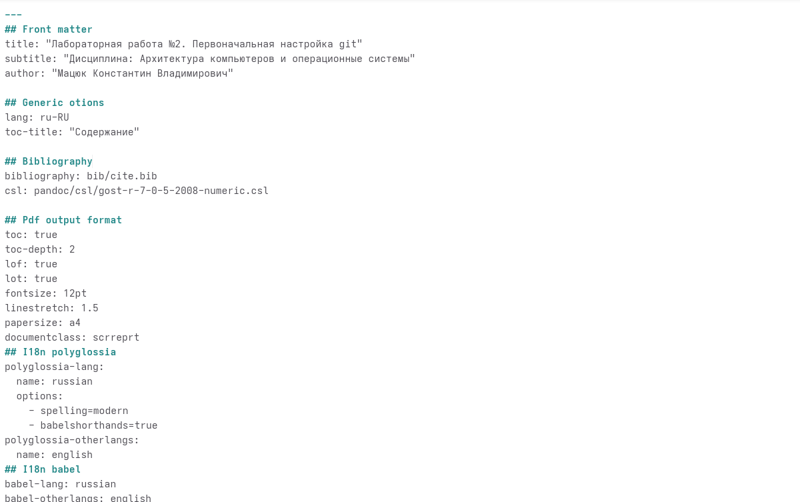
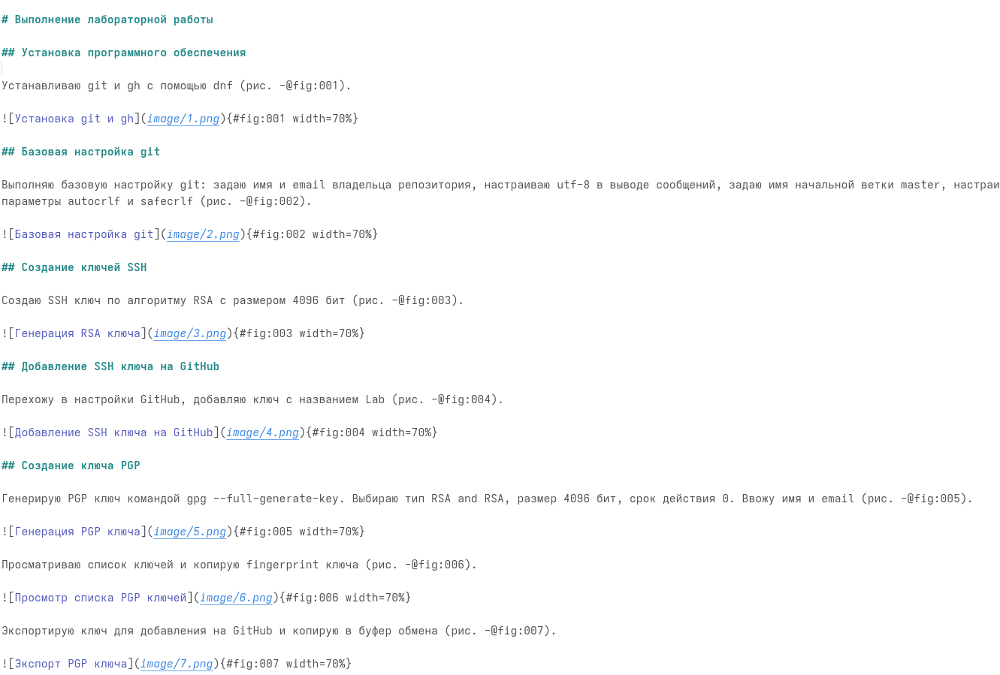
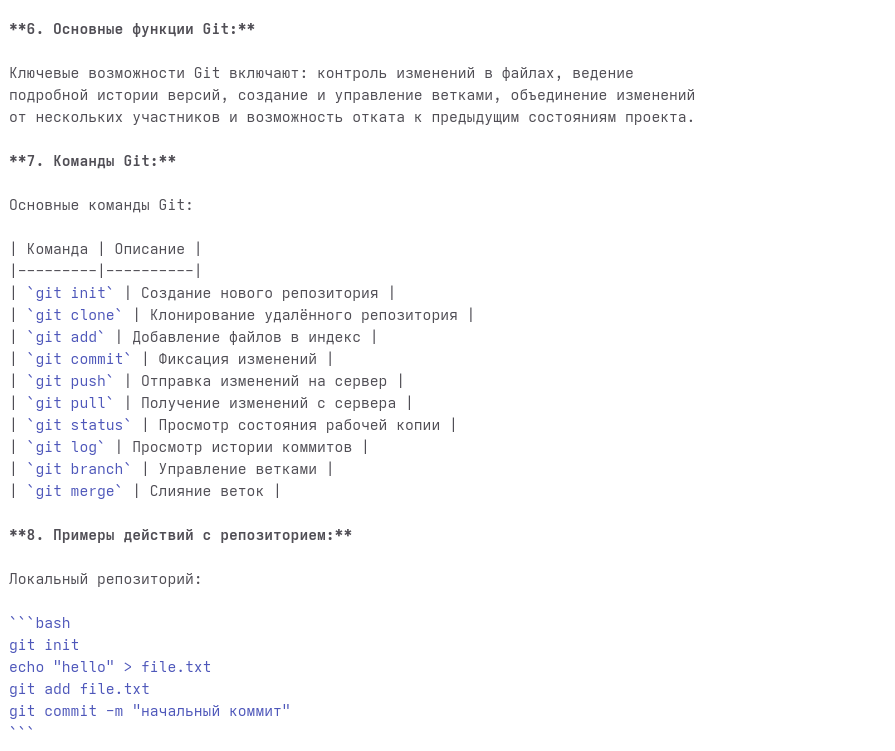
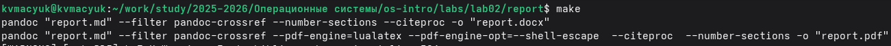
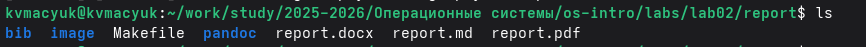

---
## Front matter
title: "Лабораторная работа №3"
subtitle: "Оформление отчётов с помощью Markdown"
author: "Мацюк Константин Владимирович"
institute: "Российский университет дружбы народов"
date: "2026"

## Generic options
lang: ru-RU

## Beamer options
theme: "metropolis"
colortheme: "default"
fonttheme: "default"
mainfont: "IBM Plex Serif"
sansfont: "IBM Plex Sans"
monofont: "IBM Plex Mono"
fontsize: 10pt
aspectratio: 169
section-titles: false
slide-level: 2
toc: true
toc-depth: 2
header-includes:
  - \usepackage{float}
  - \usepackage{indentfirst}
---

# Цель работы

Научиться оформлять отчёты с помощью легковесного языка разметки Markdown.

# Задание

- Сделать отчёт по предыдущей лабораторной работе в формате Markdown
- Предоставить файлы в 3 форматах: pdf, docx и md (в архиве, включая скриншоты и Makefile)

# Введение в Markdown

**Что такое Markdown?**

Markdown — это облегчённый язык разметки, разработанный для форматирования текста с сохранением его читаемости в исходном виде.

## Синтаксические элементы Markdown

| Элемент | Синтаксис | Назначение |
|---------|-----------|------------|
| Заголовки | `# Текст` | Уровни заголовков от 1 до 6 |
| Полужирный | `**текст**` | Выделение текста полужирным начертанием |
| Курсив | `*текст*` | Выделение текста курсивом |
| Маркированный список | `- элемент` | Создание списка с маркерами |
| Нумерованный список | `1. элемент` | Создание упорядоченного списка |
| Гиперссылки | `[текст](адрес)` | Вставка ссылок на внешние ресурсы |
| Изображения | `` | Встраивание графических файлов |

## Синтаксические элементы Markdown

| Элемент | Синтаксис | Назначение |
|---------|-----------|------------|
| Встроенный код | `` `код` `` | Выделение фрагментов программного кода |
| Блоки кода | ```` ``` ```` | Оформление многострочных листингов |
| Математические формулы | `$выражение$` | Вставка формул в формате LaTeX |

## Инструмент Pandoc

Для конвертации Markdown-документов в целевые форматы применяется инструмент **Pandoc** (https://pandoc.org/).

Базовые команды:

```bash
pandoc README.md -o README.pdf   # генерация PDF
pandoc README.md -o README.docx  # генерация DOCX
```

Автоматизация сборки реализуется с помощью **Makefile**.

# Выполнение лабораторной работы

## Заполнение YAML-шапки

Открываю файл report.md в текстовом редакторе. Вношу данные в YAML-шапку: название работы, дисциплину, сведения об авторе и параметры форматирования.

{#fig:001 width=50%}

## Оформление цели и задания

Формирую цель работы и задание.

{#fig:002 width=70%}

## Оформление хода работы

Описываю процесс выполнения лабораторной работы №2, добавляя текстовые описания действий, блоки кода с командами и ссылки на скриншоты.

{#fig:003 width=50%}

## Оформление ответов на контрольные вопросы

Создаю раздел с ответами на контрольные вопросы. Применяю нумерованные списки, выделение ключевых понятий и блоки с примерами команд.

{#fig:004 width=40%}

## Оформление ответов на контрольные вопросы

{#fig:005 width=40%}

## Оформление выводов

Завершаю отчёт разделом с выводами.

{#fig:006 width=90%}

## Компиляция отчёта

Компилирую отчёт с помощью команды make. Pandoc обрабатывает файл report.md и генерирует документы в форматах PDF и DOCX.

{#fig:007 width=90%}

## Проверка результатов

Проверяю содержимое каталога командой ls. Убеждаюсь в наличии сгенерированных версий report.pdf и report.docx.

{#fig:008 width=90%}

# Выводы

В ходе выполнения лабораторной работы:

- Изучены основные элементы разметки Markdown (заголовки, списки, таблицы)
- Освоена конвертация документов в PDF и DOCX с помощью Pandoc
- Настроена автоматизация сборки через Makefile

# Список литературы
