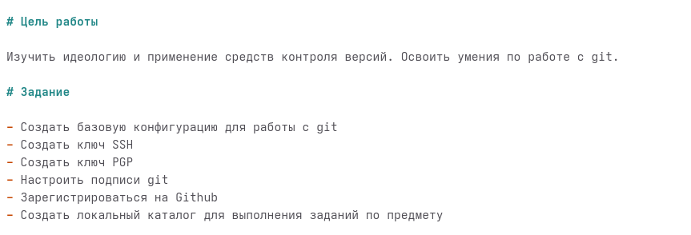
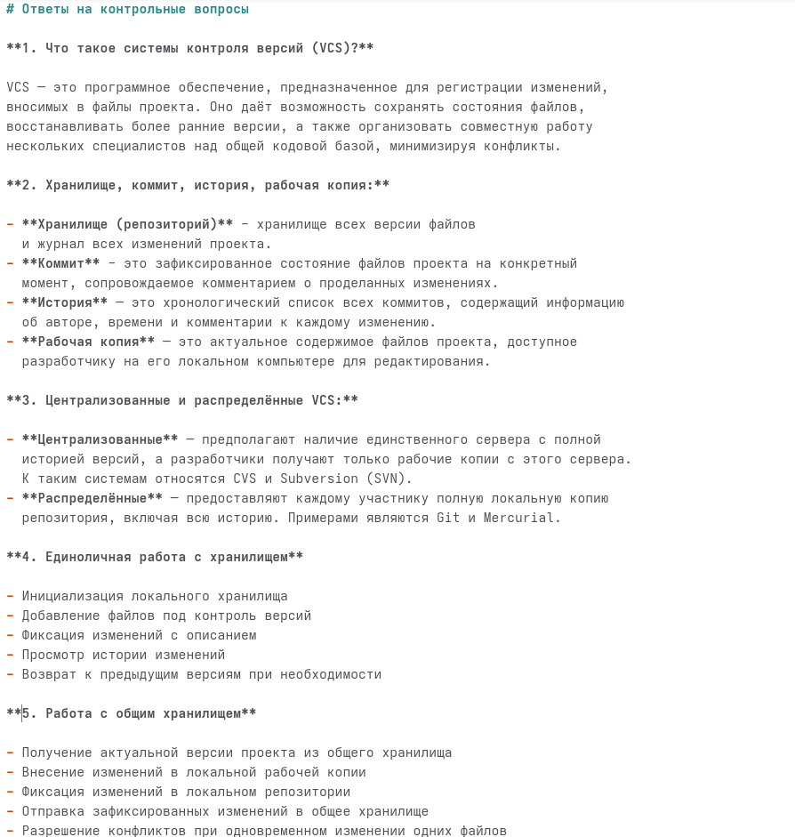
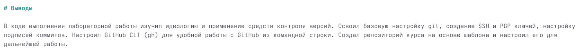

---
## Front matter
title: "Лабораторная работа №3. Markdown"
subtitle: "Дисциплина: Архитектура компьютеров и операционные системы"
author: "Мацюк Константин Владимирович"

## Generic otions
lang: ru-RU
toc-title: "Содержание"

## Bibliography
bibliography: bib/cite.bib
csl: pandoc/csl/gost-r-7-0-5-2008-numeric.csl

## Pdf output format
toc: true
toc-depth: 2
lof: true
lot: true
fontsize: 12pt
linestretch: 1.5
papersize: a4
documentclass: scrreprt
## I18n polyglossia
polyglossia-lang:
  name: russian
  options:
	- spelling=modern
	- babelshorthands=true
polyglossia-otherlangs:
  name: english
## I18n babel
babel-lang: russian
babel-otherlangs: english
## Fonts
mainfont: IBM Plex Serif
romanfont: IBM Plex Serif
sansfont: IBM Plex Sans
monofont: IBM Plex Mono
mathfont: STIX Two Math
mainfontoptions: Ligatures=Common,Ligatures=TeX,Scale=0.94
romanfontoptions: Ligatures=Common,Ligatures=TeX,Scale=0.94
sansfontoptions: Ligatures=Common,Ligatures=TeX,Scale=MatchLowercase,Scale=0.94
monofontoptions: Scale=MatchLowercase,Scale=0.94,FakeStretch=0.9
mathfontoptions:
## Biblatex
biblatex: true
biblio-style: "gost-numeric"
biblatexoptions:
  - parentracker=true
  - backend=biber
  - hyperref=auto
  - language=auto
  - autolang=other*
  - citestyle=gost-numeric
## Pandoc-crossref LaTeX customization
figureTitle: "Рис."
tableTitle: "Таблица"
listingTitle: "Листинг"
lofTitle: "Список иллюстраций"
lotTitle: "Список таблиц"
lolTitle: "Листинги"
## Misc options
indent: true
header-includes:
  - \usepackage{indentfirst}
  - \usepackage{float} # keep figures where there are in the text
  - \floatplacement{figure}{H} # keep figures where there are in the text
---

# Цель работы

Научиться оформлять отчёты с помощью легковесного языка разметки Markdown.

# Задание

1. Сделать отчёт по предыдущей лабораторной работе в формате Markdown.
2. В качестве отчёта предоставить файлы в 3 форматах: pdf, docx и md (в архиве, поскольку он должен содержать скриншоты, Makefile и т.д.)

# Введение

Markdown представляет собой облегчённый язык разметки, разработанный для форматирования текста с сохранением его читаемости в исходном виде. Ключевые конструкции языка приведены в таблице [-@tbl:markdown-syntax].

: Синтаксические элементы Markdown {#tbl:markdown-syntax}

| Элемент | Синтаксис | Назначение |
|---------|-------------|------------|
| Заголовки | `# Текст` | Уровни заголовков от 1 до 6 (количество символов #) |
| Полужирный | `**текст**` | Выделение текста полужирным начертанием |
| Курсив | `*текст*` | Выделение текста курсивом |
| Маркированный список | `- элемент` | Создание списка с маркерами |
| Нумерованный список | `1. элемент` | Создание упорядоченного списка |
| Гиперссылки | `[текст](адрес)` | Вставка ссылок на внешние ресурсы |
| Изображения | `` | Встраивание графических файлов |
| Встроенный код | `` `код` `` | Выделение фрагментов программного кода |
| Блоки кода | ```` ``` ```` | Оформление многострочных листингов |
| Математические формулы | `$выражение$` | Вставка формул в формате LaTeX |

Для конвертации Markdown-документов в целевые форматы применяется инструмент Pandoc (https://pandoc.org/). Данная утилита поддерживает преобразование в широкий спектр форматов, включая PDF, DOCX и HTML.

Базовые команды для преобразования файлов выглядят следующим образом:

```bash
pandoc README.md -o README.pdf   # генерация PDF-документа
pandoc README.md -o README.docx  # генерация документа Word
```

Автоматизация процесса сборки отчётов реализуется с помощью Makefile, содержащего правила для вызова Pandoc с необходимыми параметрами.

# Выполнение лабораторной работы

## Заполнение YAML-шапки

Открываю файл report.md в текстовом редакторе. Вношу данные в YAML-шапку: название работы, дисциплину, сведения об авторе и параметры форматирования для PDF-вывода (рис. -@fig:001).

{#fig:001 width=70%}

## Оформление цели, задания и теоретического введения

Формирую цель работы и задание (рис. -@fig:002).

{#fig:002 width=70%}

## Оформление хода работы

Описываю процесс выполнения лабораторной работы №2, добавляя текстовые описания действий, блоки кода с командами и ссылки на скриншоты. Для вставки изображений использую синтаксис Markdown для перекрёстных ссылок (рис. -@fig:003).

{#fig:003 width=70%}

## Оформление ответов на контрольные вопросы

Создаю раздел с ответами на контрольные вопросы. Применяю нумерованные списки, выделение ключевых понятий и блоки с примерами команд (рис. -@fig:004).

{#fig:004 width=70%}

{#fig:005 width=70%}

## Оформление выводов

Завершаю отчёт разделом с выводами (рис. -@fig:006).

{#fig:006 width=70%}

## Компиляция отчёта

Компилирую отчёт с помощью команды make. Pandoc обрабатывает файл report.md и генерирует документы в форматах PDF и DOCX (рис. -@fig:007).

{#fig:007 width=70%}

## Проверка результатов

Проверяю содержимое каталога командой ls. Убеждаюсь в наличии сгенерированных версий report.pdf и report.docx (рис. -@fig:008).

{#fig:008 width=70%}

# Выводы

В ходе выполнения лабораторной работы я научился оформлять отчёты с помощью легковесного языка разметки Markdown. Изучил основные элементы его разметки (заголовки, списки, таблицы и тд.), а также освоил конвертацию готовых документов в PDF и DOCX с помощью Pandoc и Makefile.

# Список литературы{.unnumbered}

::: {#refs}
:::

